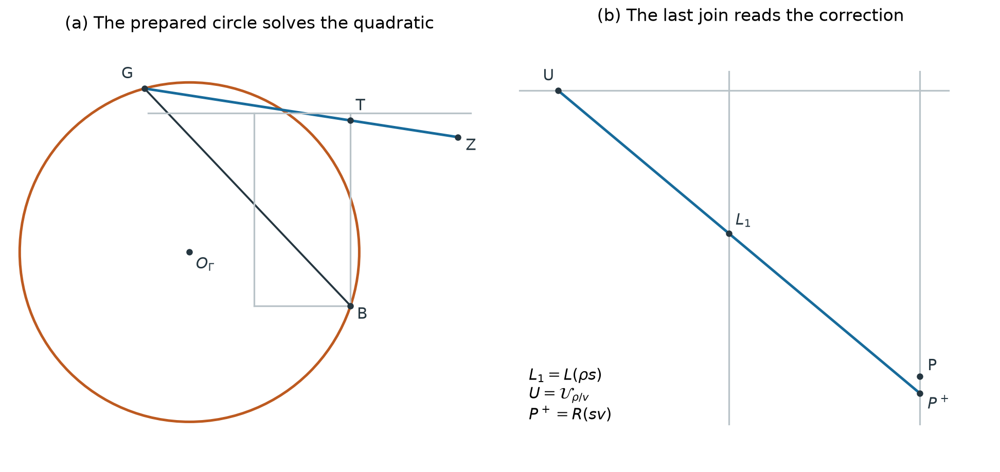

# Pandrosion

[](https://github.com/ivan-fr/pandrosion/actions/workflows/build.yml)

Geometric root calculators: explicit line-and-circle constructions, Lean developments, an interactive gallery, and behavioral analog implementations.

| Start here | What you will find |
|---|---|
| **[Geometry paper V24](paper/reciprocal_geometry_v24/Reciprocal_Root_Geometry_v24.pdf)** | Two fifth-order constructions, a precise equivalence comparison, and Theorem 4.3 formalized for every real `p>2`. |
| **[Interactive gallery](https://ivan-fr.github.io/pandrosion/)** | Enter a degree and a positive input, then perform one geometric iteration per click. Planar and stereographic views. |
| **[Analog paper V30](paper/pandrosion_analog_v30/Pandrosion_Geometry_Analog_V30.pdf)** | Binary-power AD, the centered state, circuit topology, calibration and precision–time simulations. |



The contribution studied here is the **geometric realization** of an iteration. The prepared-circle device uses `2p+2` mobile joins for a fifth-order correction that strictly reduces logarithmic error throughout its real branch. AD supplies global entry and finite-chart fallback. Decentered AD has global monotone convergence and fifth order with one arc and one join for its support. Their electrical implementation remains open; the analog prototype realizes **order-three AD**.

## Geometry and reproduction

| Method | Local order | Scalar convergence |
|---|---:|---|
| Pandrosion MA (linear) | 1 | Global monotone for `X>1`; finite chart excludes `s=1` |
| Pandrosion AK | 2 | Global for positive starts |
| Pandrosion AD / Halley | 3 | Global monotone |
| Projective AD [2/1] | 4 | Global; monotone after the first step |
| Decentered-arc AD | 5 | Global monotone |
| Pencil Halley | 3 | Global monotone |
| Pencil rational Padé [2/2] | 5 | Global monotone |
| Fixed-circle inverse [2/2] | 5 | Entire transverse real band; finite-chart conditions apply |
| Circle + AD entry/chart fallback | 5 | Global exact protocol; written convergence assembly |
| Guarded fixed circle + AD | 5 | Global exact hybrid; explicit geometric gate and fallback |

Orders refer to general degrees `p≥3`. Scalar convergence, finite geometric existence and floating-point conditioning are distinct questions. The paper specifies preparation, branch selection and counting conventions.

```sh
python3 -m pip install -r paper/reciprocal_geometry_v20/requirements.txt
python3 paper/reciprocal_geometry_v24/verify.py
bash paper/reciprocal_geometry_v24/build.sh
```

The PDF build requires Tectonic or `latexmk`. The [V24 guide](paper/reciprocal_geometry_v24/README.md) maps claims to sources and explains the verifier. [Revision notes](paper/reciprocal_geometry_v24/REVISION_NOTES.md) document the review response and proof boundaries. [CITATION.cff](CITATION.cff) provides citation metadata.

The gallery additionally offers geometric binary powering for the four rectangle supports. Automatic initialization and rectangle calibration prepare the display; iteration remains manual. Serve it locally with `python3 -m http.server 8765 --directory docs`.

- [Global fixed-circle safeguard: geometry, proof and trace counts](research/fixed_circle_safeguard/README.md)
- [Fast geometric power: incidences and costs](docs/FAST_POWER_EXPERIMENT.md)
- [Initialization, wide band, dimensions and numerical limits](docs/INITIALIZATION.md)
- [Finite nondegeneracy of the native constructions](docs/NATIVE_NONDEGENERACY.md)

## Lean

Lean and mathlib are pinned by the repository toolchain. After installing [elan](https://github.com/leanprover/elan):

```sh
lake exe cache get
python3 scripts/build_lean.py
python3 scripts/audit_lean.py
python3 scripts/audit_fast_power.py
python3 scripts/audit_circle_safeguard.py
python3 scripts/audit_branch.py
python3 scripts/audit_circle_v23.py
python3 scripts/audit_native_nondegeneracy.py
python3 scripts/audit_initialization.py
python3 scripts/audit_analog_fast_ad.py
```

The build checks the complete source library. The named audits have narrower, documented scopes and allow only the standard `propext`, `Classical.choice` and `Quot.sound` axioms. The full radical convergence argument for decentered AD is a written proof supported by formal polynomial identities. The [V24 formal claim map](paper/reciprocal_geometry_v24/LEAN_THEOREM_4_3.md) covers the real-degree circle theorem, including inverse selection, convergence and exact order five. See also the [V24 evidence map](paper/reciprocal_geometry_v24/README.md#proof-and-evidence-map) and the detailed [V20 coverage table](paper/reciprocal_geometry_v20/CLAIM_COVERAGE.md).

## Analog application

The [centered binary-power AD prototype](research/analog_fast_ad/README.md) uses digitally prepared inputs and the state `q=p(u−1)`. Its behavioral SPICE models expose input loading, memory, settling, noise and calibration assumptions. The arithmetic campaign covers 8,243 input pairs; the calibrated precision study meets one ppm in 64 validation cases, with worst simulated error 0.279 ppm at 23.985 ms. These are simulation results, not fabricated-chip measurements or evidence of superiority to digital calculation.

- [V30 sources, diagrams and reproduction](paper/pandrosion_analog_v30/README.md)
- [Generalist input campaign](research/analog_fast_ad/GENERALIST.md)
- [Precision circuit results](research/analog_fast_ad/PRECISION_REVISION_RESULTS.md)
- [Precision–time study](research/analog_fast_ad/SPEED_ACCURACY.md)
- [Hardware assumptions](research/analog_fast_ad/HARDWARE_ACCURACY.md) and [engineering review](research/analog_fast_ad/ENGINEERING_REVIEW.md)

## Validation and development

GitHub Actions separately checks Lean and axiom audits, symbolic/high-precision geometry, browser interactions, all seven paper builds, and the behavioral circuit campaigns. PDFs, screenshots and result records are uploaded as workflow artifacts. The existing protected-branch paper status name is retained even though it now includes V21, V22, V23 and V24.

```sh
npm ci
npm run test:geometry
npx playwright install chromium
python3 -m http.server 8765 --directory docs
# In a separate terminal:
npm run test:browser
```

The gallery uses local HTML, CSS and JavaScript; Playwright is a development dependency. The CI badge reports the current main-branch workflow, not historical priority, optimality or hardware certification.

## Archives

[V22 geometry](paper/reciprocal_geometry_v22/README.md), [V21 geometry and safeguard](paper/reciprocal_geometry_v21/README.md), [V20 geometry](paper/reciprocal_geometry_v20/README.md), its [review](paper/reciprocal_geometry_v20/REVIEW_V20.md), the [V19 erratum](ERRATA.md), and [analog V17](paper/pandrosion_analog_v17/Pandrosion_Geometry_Analog_V17.pdf) remain available. The historical [P0](research/pandrosion_analog/README.md), [P1](research/pandrosion_analog_p1/README.md), [P2](research/pandrosion_analog_p2/README.md), [P3](research/pandrosion_analog_p3/README.md) and [P4](research/pandrosion_analog_p4/README.md) circuit studies retain their original netlists and evidence.

## License

This project is licensed under the [MIT License](LICENSE). Copyright © 2026 Ivan Besevic.
