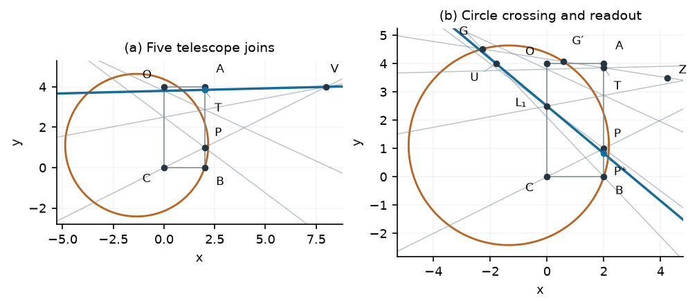

# Pandrosion

[](https://github.com/ivan-fr/pandrosion/actions/workflows/build.yml)

Geometric constructions for reciprocal nth roots, Lean proofs, and behavioral analog implementations of root iterations.

**Read the [V20 paper](paper/reciprocal_geometry_v20/Reciprocal_Root_Geometry_v20.pdf)** — 18 pages, seven vector figures. The paper brings together Pandrosion AK and AD, projective AD [2/1], decentered-arc AD, pencil constructions, and the new fixed-circle inverse-quadratic correction.



## Geometry and paper

| Method | Local order | Scope in V20 |
|---|---:|---|
| Pandrosion AK | 2 | Classical geometric support |
| Pandrosion AD | 3 | Centered-arc support / Halley correction |
| Projective AD [2/1] | 4 | Projective support |
| Decentered-arc AD | 5 | Written global monotone convergence proof |
| Pencil Halley | 3 | Global positive scalar convergence |
| Rational Padé [2/2] | 5 | Global positive scalar convergence |
| Fixed-circle inverse [2/2] | 5 | Local convergence; 2p+2 mobile joins in the finite nondegenerate protocol |

Orders shown are for the non-exact general case; special degrees can give exact corrections. Construction costs and preparation assumptions are detailed in the paper's first-page table.

- [Paper sources, figures and reproduction guide](paper/reciprocal_geometry_v20/README.md)
- **[Open the interactive geometry gallery](https://ivan-fr.github.io/pandrosion/)**: seven V20 constructions and four experimental binary-power modes, step-by-step plane and stereographic views, degree controls and nine historical demonstrations. Locally, serve `docs/` with `python3 -m http.server 8765 --directory docs`.
- [Formal claim coverage](paper/reciprocal_geometry_v20/CLAIM_COVERAGE.md) and [V20 review](paper/reciprocal_geometry_v20/REVIEW_V20.md)

The fixed-circle method has a local convergence result. A numerical real-branch domain is not a global convergence proof. The stereographic sphere is a visualization; homogeneous incidence data retain the distinct points at infinity.

The V20 revision adds a uniform rational circle preparation, explicit exceptional cases, renormalization and expanded references. Its new preparation identity is symbolically checked; the existing Lean audit is unchanged. Whole-branch strict error decrease is explicitly conjectural. See [the V19 erratum](ERRATA.md).

## Post-V20 experiment: fast power

The gallery adds **AKfast, ADfast, projectiveFast and arcFast**, replacing only
the power telescope with geometric binary exponentiation. The scalar iterations
and orders are unchanged. For p=1024, ten multiplications replace 1023 native
stages. The V20 paper and its 57-module formal snapshot remain frozen.

The adaptive dyadic normalization button minimizes a conditioning score among
tested scales; it is a heuristic, not a global optimum theorem. Stereographic
fallback changes the display only: all incidences remain planar and homogeneous.
See [geometry, costs, numerical limits and formal coverage](docs/FAST_POWER_EXPERIMENT.md).

The separate [native non-degeneracy audit](docs/NATIVE_NONDEGENERACY.md)
([JSON table](docs/NATIVE_NONDEGENERACY.json)) proves finite geometric existence
for all four original rectangle protocols on p≥3, W,H,X,s>0, and transfers it
to the fast modes. It checks actual joins, parallels and circle branches;
this is separate from scalar convergence and floating-point conditioning. Its
51-declaration audit is independent of the 22-declaration fast-power audit and
the frozen V20 149+11 audit.

The simple gallery automatically prepares the original p and X in a certified
wide band, 1/4≤Xc^p≤4, and chooses rectangle proportions. **Iterations remain
manual: one click, one geometric step.** Original X stays visible; internal
calibration lives in the advanced panel. Circles are rebuilt for the selected
width and height, and a local view magnifies the final readout without stretching
geometry. Advanced mode retains the narrower [1,2] option and all protocols.
The initialization/dimension module has **34 audited declarations**. See
[theorems, layout, rounding certificates and limits](docs/INITIALIZATION.md).

## Lean

The repository includes all 239 source modules in `LeanMath/`, 31 supplementary research modules and two standalone algebra files in `lean/`. `LeanMath.lean` imports the complete main library. Historical coefficient certificates are retained, accounting for most of the source size.

Lean and mathlib are pinned to **4.33.1**. After installing [elan](https://github.com/leanprover/elan):

```sh
lake exe cache get
python3 scripts/build_lean.py
python3 scripts/audit_lean.py
python3 scripts/audit_fast_power.py
python3 scripts/audit_native_nondegeneracy.py
python3 scripts/audit_initialization.py
python3 scripts/audit_analog_fast_ad.py
```

The build script checks every one of the 272 modules in dependency order and then all default library targets. The V20 axiom audit checks **149 geometric declarations plus 11 analytical background declarations** and permits only `propext`, `Classical.choice` and `Quot.sound`. This audit has a narrower scope than the full library build. See the claim-coverage document for the boundary between formal algebraic certificates and written analytic proofs; in particular, the complete analytic convergence theorem for decentered AD is not yet formalized.

The paper also retains its self-contained 57-module source snapshot in `paper/reciprocal_geometry_v20/formal/`.

## Analog prototype

The [hardware accuracy study](research/analog_fast_ad/HARDWARE_ACCURACY.md) adds
explicit tolerance budgets, temperature/noise experiments and settling checks.
The [engineering follow-up](research/analog_fast_ad/ENGINEERING_REVIEW.md) adds
combined transient errors, simulated electrical calibration and an end-to-end
digital comparison. It establishes no speed/energy advantage or uniform accuracy.
The [generalist campaign](research/analog_fast_ad/GENERALIST.md) now covers
thousands of input pairs, hundreds of timed runs and alternatives to a periodic
clock, with a dedicated continuous-integration job.
These characterize behavioral models, not measured silicon.

The new [binary-power AD prototype](research/analog_fast_ad/README.md) uses the
gallery's certified digital preparation and an amplified analog state
`q=p(u−1)`. It includes a behavioral SPICE example at p=1,000,000, X=500,000,
six Lean arithmetic certificates and explicit finite-precision limitations.
It is a mixed-signal feasibility model, not fabricated hardware.


The analog work consists of authored behavioral SPICE models, circuit netlists and numerical validation. It is a simulation-stage design, without a fabricated chip, foundry PDK or physical layout. The models are not manufacturer macromodels.

- [Analog companion paper (V17)](paper/pandrosion_analog_v17/Pandrosion_Geometry_Analog_V17.pdf)
- [P0](research/pandrosion_analog/README.md), [P1](research/pandrosion_analog_p1/README.md), [P2](research/pandrosion_analog_p2/README.md), [P3](research/pandrosion_analog_p3/README.md), **[P4: explicit input loading and buffered storage](research/pandrosion_analog_p4/README.md)**

P4 includes 40 main SPICE runs and five independent RC/time-step checks. It evaluates AD and Halley chains with input loading, storage isolation, endpoint calibration and selected parameter perturbations. Its measured simulation errors do not establish hardware performance.

With Python and ngspice installed:

```sh
python3 -m pip install -r research/pandrosion_analog_p4/requirements.txt
python3 research/pandrosion_analog_p4/simulate_p4.py
python3 research/pandrosion_analog_p4/verify_p4.py
```

These commands regenerate the P4 result files. Archived companion snapshots remain unchanged.

## Reproduce the paper and numerical checks

```sh
python3 -m pip install -r paper/reciprocal_geometry_v20/requirements.txt
cd paper/reciprocal_geometry_v20
python3 src/revision/verify.py
python3 src/review/check_math.py
python3 src/fixed_circle/verify.py
python3 src/stereo/model.py
python3 src/decentered/verify.py
bash build.sh
```

The paper build requires Tectonic or a TeX installation with `latexmk`. Supplied vector figures make the PDF build independent of figure regeneration.

## Continuous integration

The badge links to the actual GitHub Actions workflow. It passes only when all validation areas succeed:

1. Build all 272 Lean sources and the complete library; check the frozen 149+11 audit and the separate 22, 51, 34 and 6 declaration post-V20 audits.
2. Repeat symbolic and high precision geometry checks.
3. Rebuild the V20 PDF and the analog companion PDF.
4. Rerun the P4 SPICE study and its validation checks.
5. Check 864 geometry cases, 800 rectangle cases, 600 narrow and 600 wide initialized trajectories; exercise all eleven methods, nine archived previews and mobile layouts in a browser.

Successful full builds cache the Lean artifacts under a key derived from the proof sources, toolchain and build configuration. Lake checks source and dependency hashes on subsequent builds.

Fresh PDFs, browser screenshots and P4 validation records are downloadable as workflow artifacts. No claim of historical priority, optimal geometric cost or experimentally measured chip performance is implied by a successful build.

## Preview development

```sh
npm ci
npm run test:geometry
npx playwright install chromium
python3 -m http.server 8765 --directory docs
# Separate terminal:
npm run test:browser
```

The gallery itself uses only local HTML, CSS and JavaScript. Playwright is a development dependency for browser checks, not a public-site dependency.

The new [analog precision mode](research/analog_fast_ad/PRECISION_REVISION.md)
passes a 1 ppm target in 64 held-out behavioral circuit tests (worst: 0.279 ppm),
with added calibration and about 24 ms readout latency. A separate noisy
completion controller passes 18 normal and four fail-closed fault tests.
[Detailed results and assumptions](research/analog_fast_ad/PRECISION_REVISION_RESULTS.md)
are reproduced by a dedicated CI job; physical circuit performance remains unvalidated.
