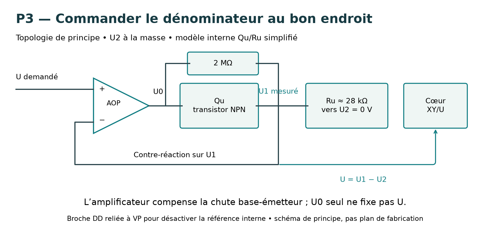
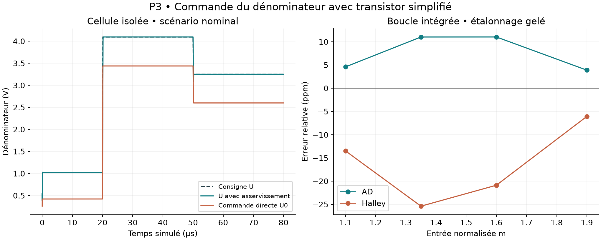

# Pandrosion analogique P3 — cellule XY/U et commande du dénominateur

17 septembre 2026. **58 simulations SPICE : 28 cellules isolées, 28 essais des chaînes intégrées et deux contrôles avec pas temporel réduit.** P1 et P2 sont conservés sans modification.

La commande de dénominateur par amplificateur et transistor simplifié fonctionne dans les scénarios testés et préserve la convergence numérique observée des chaînes cubiques AD et Halley. Cette étape remplace une entrée idéale U par une boucle électronique dynamique. **Il s'agit d'un modèle de faisabilité, pas d'un modèle constructeur AD734 ni d'une validation de carte ou de puce.**

## Correction de la référence documentaire

La commande précise de dénominateur est la **figure 29 de la fiche AD734, révision E**, et non la figure 28 mentionnée dans P2 ; cette dernière concerne la racine carrée. La topologie a aussi été inspectée visuellement dans la figure 10, page 8, de la révision C du même fabricant, hébergée par DigiKey. Sources : [AD734 révision E](https://www.analog.com/media/en/technical-documentation/data-sheets/ad734.pdf), [copie de la révision C](https://media.digikey.com/pdf/Data%20Sheets/Analog%20Devices%20PDFs/AD734.pdf).

Pour notre usage à dénominateur positif : entrée + de l'amplificateur à la consigne, entrée − à U1 (broche 4), sortie à U0 (3), U2 (5) à la masse, résistance 2 MΩ entre U0 et U1. DD (13) est reliée à VP (14) pour désactiver la référence interne. W (12) est rebouclée sur Z1 (11), Z2 (10) à la masse. Les paires X1/X2 et Y1/Y2 reçoivent les signaux différentiels. Alimentation proposée ±15 V, découplages locaux à prévoir conformément à la fiche. Ces connexions sont issues du montage documenté ; elles ne constituent pas une invention nouvelle.



## Modèle simulé et hypothèses

Un NPN approximatif représente Qu, avec Ru=28 kΩ entre son émetteur U1 et la masse. Le collecteur est raccordé à une alimentation idéale +15 V dans notre approximation ; le circuit interne réel qui reçoit ce courant n'est pas reproduit. Le cœur calcule encore XY/U au moyen d'une source comportementale dynamique.

Paramètres supposés du NPN, **non extraits du silicium AD734** : Is=10⁻¹⁵ A, β=199, Vaf=100 V, Cje=2 pF, Cjc=1 pF, Tf=0,3 ns. Capacité supplémentaire sur U1 : 2, 20 ou 200 pF. Ru : 22,4 / 28 / 33,6 kΩ, correspondant à un balayage ±20 %. La fiche indique cette tolérance de la résistance interne, mais la conversion réelle courant–dénominateur et ses compensations internes ne sont pas modélisées.

L'amplificateur réutilise le modèle P2 : gain ouvert 10⁶, GBW 10 MHz, slew rate 20 V/µs, courant limité à 5 mA, résistance de sortie 10 Ω, offset +25 µV. Ce modèle à un pôle ne suffit pas à garantir les marges de stabilité du composant réel. Aucun modèle constructeur ni PDK n'est utilisé.

## Essais isolés

La commande passe de 1,024 à 4,096 puis 3,25 V, avec transitions de 100 ns. X=1 V, Y=4 V ; le quotient idéal est 4/U. Le produit et les entrées X/Y restent idéaux dans cet essai, avec une réponse de sortie à constante de temps 100 ns.

Les 27 combinaisons Ru × capacité × température (0, 27, 70 °C) passent :

- Erreur finale de dénominateur inférieure à **6.516 ppm**.
- Après la fin du front montant, établissement de U à ±0,1 % en au plus **0.262 µs**.
- Après le front descendant, au plus **2.715 µs**.

L'établissement signifie que tous les échantillons restants du plateau testé sont dans la bande. Ce n'est ni une marge de phase ni une garantie d'absence d'oscillation dans toutes les conditions. La température affecte le transistor SPICE ; le modèle d'amplificateur, les résistances et le reste du cœur n'ont pas de dérive thermique ajoutée. Il ne s'agit donc pas d'une qualification thermique du circuit.

Un contrôle volontairement naïf impose directement la consigne à U0, sans asservissement : l'erreur finale de U atteint **-20.01 %**, et celle de XY/U **+25.01 %**. Il illustre la chute base-émetteur qui manquait au modèle initial ; il ne représente pas le montage recommandé par le fabricant.



## Réintégration dans les boucles

Une commande DEN indépendante est ajoutée à chaque cellule arithmétique : six pour le modèle AD avec sortie géométrique de diagnostic, trois pour Halley direct. Pour une version AD avec la seule sortie inverse, cinq cellules arithmétiques suffiraient ; P3 conserve le diagnostic. Les limiteurs de port utilisent maintenant les dénominateurs effectivement produits par ces commandes.

La formule exacte de l'état AD reste, pour p=3 :

    s⁺ = s (1 + m s³/2) / (1/2 + m s³), s₀ = 1 ; y = 1/s.

Par inversion, elle est conjuguée à Halley. Les hypothèses électroniques ne modifient pas cette identité idéale, mais les trajectoires simulées comportent des erreurs.

Même convention P2 : Vin=4,096m V, cible 4,096∛m V, m∈[1,2]. Après reset et six cycles, lecture à 645 µs. Étalonnage électrique ajusté à m=1 et 2, puis gelé. Entrées inédites : 1,1 ; 1,35 ; 1,6 ; 1,9.

| Chaîne | Erreur de sortie maximale, entrées inédites | Écart de commande U au point de lecture, six entrées |
|---|---:|---:|
| AD | 11.035 ppm | 21.304 µV |
| Halley | 25.378 ppm | 21.266 µV |

Quatre essais supplémentaires par chaîne changent Ru à 22,4 ou 33,6 kΩ avec capacité 200 pF, aux entrées 1,1 et 1,9, sans réétalonnage. Ils passent le seuil de 30 ppm choisi pour cette étude. Ce ne sont pas des maxima sur tout l'intervalle ni des coins complets de fabrication. Les erreurs déterministes du cœur sont celles du scénario P2 `untrimmed_stress`, sans ajouter la variabilité réelle du multiplicateur.

Les deux répétitions à pas maximal 20 ns, au lieu de 100 ns, vérifient la sortie finale à m=2 pour AD et Halley ; les écarts sont conservés dans `VALIDATION.json`. Cela vérifie la sensibilité au pas sur ces deux sorties finales, pas la précision de toutes les pointes transitoires.

## Décision pour la suite

L'asservissement du dénominateur mérite d'être retenu pour un prototype de laboratoire. **La priorité suivante est l'impédance réelle des ports X/Y et la charge imposée aux mémoires**, puis la vérification avec modèles fabricants et mesures sur une cellule. Le cœur P1/P2, encore utilisé ici, ne reproduit pas ces impédances : relier directement ses mémoires à une entrée physique peut changer fortement le résultat.

Le calcul numérique globalement convergent ne garantit pas la convergence d'un circuit saturé. La garde max(U,0,4 V) du modèle sert au démarrage numérique ; une protection physique contre un dénominateur trop faible et le séquencement d'alimentation restent à concevoir. Le modèle de servo ajoute un courant de collecteur mais le cœur et les amplificateurs utilisent encore des sources comportementales : **aucun bilan crédible d'énergie, puissance, surface ou avantage AD/Halley n'en découle**. Pas de nouvelle preuve Lean, pas de résultat de silicium et pas de nouveauté historique revendiqués.

## Fichiers et reproduction

Python, numpy, matplotlib et ngspice sont nécessaires.

```sh
python simulate_p3.py
python verify_p3.py
python make_report.py
```

`core_p1.py` et `p2_base.py` sont des copies autonomes des générateurs précédents. `cell_nominal.cir`, `cell_naive.cir`, `ad_p3.cir`, `halley_p3.cir` sont exécutables avec ngspice ; lancer chaque circuit dans son propre répertoire car ils écrivent tous `waveform.txt`. Les CSV et logs sont conservés. Les paramètres de modèle sont explicites dans `simulate_p3.py`. `results.json` contient les 56 essais principaux ; `VALIDATION.json` documente les deux contrôles supplémentaires.
