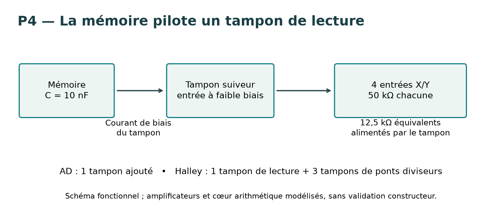
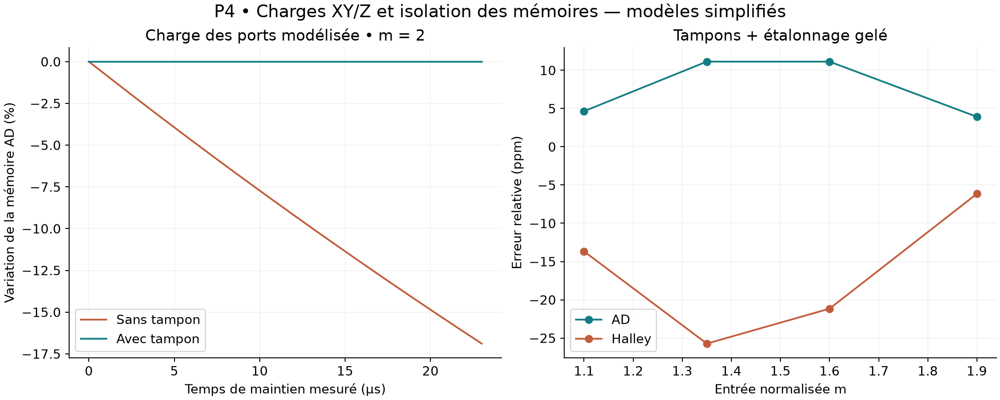

# Pandrosion analogique P4 — isolation des mémoires et charge des ports

17 septembre 2026. **45 simulations dans le jeu de validation final** : 40 essais de chaîne, trois contrôles RC indépendants et deux répétitions à pas temporel réduit. Les versions P1 à P3 sont conservées.

**Défaut identifié : la mémoire AD de P3 ne peut pas alimenter directement les entrées résistives du multiplicateur sans se décharger fortement.** Le tampon de lecture corrige ce problème dans le modèle. La précision publiée pour P3 ne pouvait donc pas être transposée directement à une carte.

## Charge documentée et approximation retenue

La fiche AD734 indique 50 kΩ différentiels pour chaque paire X, Y et Z, avec tolérance ±20 %, et une capacité différentielle typique de 2 pF. Dans nos connexions à deuxième borne mise à la masse, cela justifie un modèle de charge vers la masse. Le courant de biais typique est 50 nA ; la spécification maximale du grade B à 25 °C est 150 nA. [Fiche AD734, pages 4 et 10](https://www.analog.com/media/en/technical-documentation/data-sheets/ad734.pdf).

P4 ajoute donc, à **chaque port X/Y/Z de chaque cellule**, 50 kΩ, 2 pF et un courant de biais de 50 nA. Z1 est relié à la sortie arithmétique et Z2 à la masse ; la charge Z est appliquée à cette sortie. Le modèle ne reproduit pas les impédances de mode commun ni toutes les dépendances internes.

Le dénominateur conserve le servo simplifié de P3. Les équations du cœur, ses erreurs déterministes et ses limiteurs restent comportementaux. Les sources de Vin et de référence restent idéales en impédance : leur charge apparaît, mais leur affaissement n'est pas étudié ici.

## Pourquoi la mémoire AD échoue

Quatre ports sont reliés à l'état : X et Y de q2, Y de q3, Y du pas suivant. En parallèle, ils donnent R=50 kΩ/4=12,5 kΩ. Avec C=10 nF :

    τ = RC = 125 µs
    V(t+Δt)/V(t) = exp(−Δt/τ)
    pour Δt = 23 µs : perte ≈ 16,8 %.

Ce calcul RC néglige les biais et autres fuites. Les trois simulations RC indépendantes (charges 10 / 12,5 / 15 kΩ) vérifient la loi exponentielle. Dans la chaîne AD chargée, la perte mesurée entre 626 et 649 µs atteint **16,89 %**. Cet intervalle commence après l’ouverture du dernier interrupteur de suivi, vers 625 µs.

La chaîne AD dépasse alors la plage du port X et sature : le rapport maximal au seuil vaut environ 4,10. Son erreur de sortie atteint 149 % avec les anciens réglages. Ces valeurs signalent un **échec**, pas un régime acceptable à étalonner.

## Modification retenue



- **AD : un tampon de lecture** entre le condensateur d'état et les quatre ports. Le servo du dénominateur inverse reçoit aussi la lecture tamponnée.
- **Halley : un tampon de lecture et trois tampons de ponts diviseurs**, placés après les atténuateurs `att_state`, `att_q2` et `att_num`. Les résistances d'entrée changeraient leurs rapports si on les raccordait directement. La mémoire Halley était déjà protégée de cette forte charge par le modèle de gain intermédiaire ; son erreur vient surtout ici des ponts chargés.

Les nouveaux tampons sont des suiveurs à contre-réaction utilisant le modèle d'amplificateur P2 : gain ouvert 10⁶, GBW 10 MHz, slew rate 20 V/µs, courant limité à 5 mA, résistance de sortie interne 10 Ω, biais 20 pA et offset +25 µV. Ce modèle à un pôle n'est pas un modèle fabricant et ne garantit pas la stabilité réelle.

La variation de mémoire AD sur les mêmes 23 µs descend sous **3,6 ppm**, et celle de Halley sous **3 ppm**, sur les six entrées nominales. Les fuites de mémoire de 5 nA et l'injection de charge de 5 pC de P2 sont conservées.

## Résultats de sortie

Domaine inchangé : racine cubique, m∈[1,2], Vin=4,096m V, cible 4,096∛m V. Reset 50 µs, six cycles de 100 µs, lecture à 645 µs. AD reste conjuguée mathématiquement à Halley par inversion de l'état ; la réalisation géométrique n'établit pas de supériorité énergétique.

| Chaîne | Charges ajoutées, anciens réglages P3 | Tampons + nouvel étalonnage, quatre entrées inédites | Variations de ports, réglages gelés |
|---|---:|---:|---:|
| AD | 149.2046 % | 0.001113 % | 0.004385 % |
| Halley | 7.7376 % | 0.002573 % | 0.002198 % |

**Les colonnes utilisent des protocoles différents.** La première conserve les réglages P3 pour diagnostiquer l'ajout des charges ; la deuxième refait l'étalonnage à m=1 et 2 après ajout des tampons. Il ne faut pas attribuer toute la réduction d'erreur aux seuls tampons. La variation de tension du condensateur est, elle, une mesure directe de leur effet d'isolation.

Les entrées inédites sont 1,1 ; 1,35 ; 1,6 ; 1,9. Les variations sont deux scénarios globaux, appliqués à tous les ports : (40 kΩ, +150 nA, 10 pF) et (60 kΩ, −150 nA, 10 pF), chacun testé à 1,1 et 1,9. Les 10 pF et la polarité négative du biais sont des hypothèses de stress, pas une spécification garantie du fabricant. Ce n'est ni du Monte-Carlo ni un pire cas sur toutes les combinaisons.



Tous les essais tamponnés restent sous 0,95 pour le rapport au seuil de port et sous 50 ppm d'erreur de sortie dans ces scénarios. Les deux répétitions à pas maximal 20 ns, contre 100 ns, contrôlent la sortie finale à m=2. Les valeurs exactes sont dans `VALIDATION.json`.

## Portée matérielle

L'étude impose désormais des tampons de lecture et une protection des rapports résistifs. Elle rapproche le schéma d'un prototype mesurable ; elle ne démontre pas une précision sur silicium. Les valeurs de calibration sont encore continues et la source de réglage idéale.

Restent notamment : modèles fabricants des amplificateurs et multiplicateurs, impédance des références et de l'entrée, bruit, mismatch indépendant des composants, dérives thermiques complètes, séquencement d'alimentation, protection U faible et essais sur banc. Les sources comportementales ne permettent toujours pas un bilan crédible de puissance, énergie ou surface. Le nombre de tampons ajouté ici compare deux schémas particuliers ; il ne prouve pas que l'une des méthodes est meilleure matériellement.

**Prochaine étape utile : une cellule mémoire tamponnée mesurable et une cellule XY/U sur banc**, avec vérification du maintien, de l'établissement et du démarrage. Avant un routage ou une fabrication, les modèles réels et la stabilité des amplificateurs doivent être confrontés aux mesures. Aucun circuit n'a été fabriqué et aucune nouvelle preuve Lean n'est ajoutée.

## Reproduction

```sh
python simulate_p4.py
python verify_p4.py
python make_report.py
```

Dépendances : Python, numpy, matplotlib, ngspice. `p3_reference.json` conserve les réglages P3. `p3_base.py`, `p2_base.py` et `core_p1.py` rendent le dossier autonome. Les quatre netlists `ad_loaded.cir`, `ad_buffered.cir`, `halley_loaded.cir`, `halley_buffered.cir` correspondent à m=2 ; les logs et CSV sont inclus. Exécuter les netlists dans des répertoires distincts, car chacune écrit `waveform.txt`. `results.json` conserve les 40 essais principaux. `verify_p4.py` ajoute les cinq contrôles indépendants.
