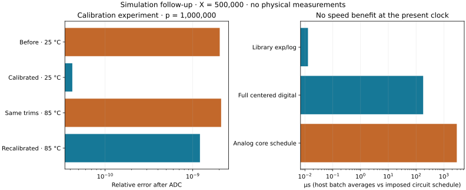

# Engineering follow-up results

Behavioral simulations and host benchmarks only. See [assumptions and limits](ENGINEERING_REVIEW.md).

## Joint transient errors

These are signed scenarios, not percentiles or exhaustive corner bounds. Targets: one ppm at p≤32, one ppb at larger p.

| p | Profile | Temperature °C | Clock scale | Maximum timestep parameter | Relative error after configured ADC | Target met |
|---:|:---|---:|---:|:---|---:|:---|
| 3 | untrimmed | 25 | 1 | 0.2u | 0.000408639 | **no** |
| 3 | untrimmed | 85 | 1 | 0.2u | 0.000644509 | **no** |
| 3 | trim_target | 25 | 1 | 0.2u | 5.56334e-06 | **no** |
| 3 | trim_target | 85 | 1 | 0.2u | 1.21771e-05 | **no** |
| 32 | untrimmed | 25 | 1 | 0.2u | 3.12631e-05 | **no** |
| 32 | untrimmed | 85 | 1 | 0.2u | 4.06708e-05 | **no** |
| 32 | trim_target | 25 | 1 | 0.2u | 3.94187e-07 | yes |
| 32 | trim_target | 85 | 1 | 0.2u | 9.0329e-07 | yes |
| 983039 | untrimmed | 25 | 1 | 0.2u | 5.04928e-09 | **no** |
| 983039 | untrimmed | 85 | 1 | 0.2u | 1.33029e-09 | **no** |
| 983039 | trim_target | 25 | 1 | 0.2u | 6.37815e-11 | yes |
| 983039 | trim_target | 85 | 1 | 0.2u | 9.92002e-11 | yes |
| 1000000 | untrimmed | 25 | 1 | 0.2u | 2.03289e-09 | **no** |
| 1000000 | untrimmed | 85 | 1 | 0.2u | 1.84285e-09 | **no** |
| 1000000 | trim_target | 25 | 1 | 0.2u | 3.11237e-11 | yes |
| 1000000 | trim_target | 85 | 1 | 0.2u | 6.51973e-11 | yes |
| 1000000 | untrimmed | 85 | 30 | 0.2u | 5.09831e-08 | **no** |
| 1000000 | trim_target | 85 | 30 | 0.2u | 4.36436e-10 | yes |
| 1000000 | trim_target | 85 | 1 | 0.05u | 6.51973e-11 | yes |

## Simulated measured-cell calibration

Reference voltages are ideal; measurement noise and 24-bit coefficient rounding are included. Additional trim paths are behavioral.

| p | Before, 25 °C | After, 25 °C | Room-temperature trims at 85 °C | Recalibrated at 85 °C |
|---:|---:|---:|---:|---:|
| 3 | 0.000408639 | 1.41483e-05 | 0.000427578 | 0.000225597 |
| 1000000 | 2.03289e-09 | 4.23092e-11 | 2.10918e-09 | 1.20891e-09 |

## Digital comparison at X=500,000

Host: Apple M5, darwin/arm64, Node v24.20.0. Median batched time per operation; not portable single-call latency.

| p | Preparation µs | Six digital steps only µs | Full centered digital µs | Library exp/log µs | Analog schedule µs, excludes preparation/converters |
|---:|---:|---:|---:|---:|---:|
| 3 | 12.267 | 0.061045 | 12.412 | 0.014834 | 2905 |
| 32 | 17.35 | 0.15105 | 17 | 0.014146 | 2905 |
| 983039 | 234.59 | 0.96229 | 234.82 | 0.013 | 2905 |
| 1000000 | 179.21 | 0.68791 | 179.3 | 0.012875 | 2905 |

All 24 representative digital outputs were independently scored below 2e-13 relative error. No analog speed or energy advantage is established. Energy is unmeasured.

19 combined timed runs, eight calibrated/uncalibrated timed runs and four DC calibration benches completed. A fine-timestep repeat is included among the 19 runs. The earlier baseline circuit was also checked for regressions at three degrees.
