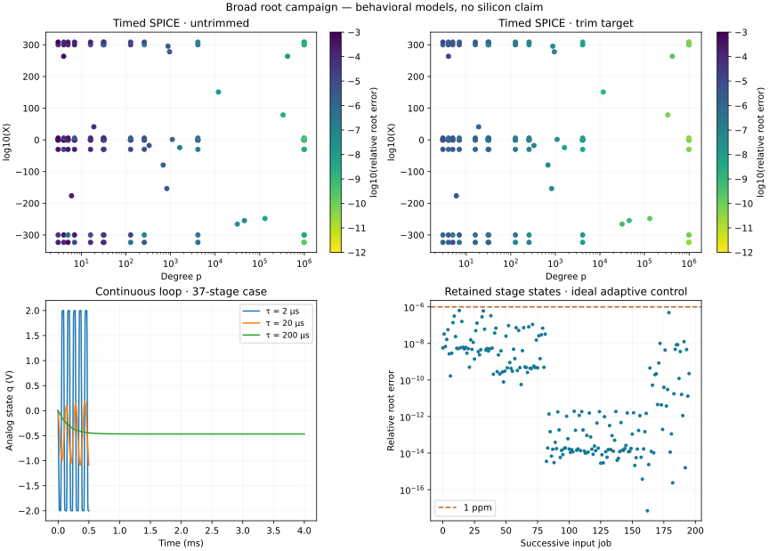

# Generalist campaign results

Read [architecture and scope](GENERALIST.md) before interpreting the counts. Tests are simulations, not physical measurements.

Arithmetic: 8,243 pairs, 4,278 distinct degrees, 24,729 evaluations. Maximum ideal relative error: 1.14e-16.

## Combined timed SPICE matrix

| Profile | Runs | Execution/range failures | At most 1 ppm | At most 1 ppb | Worst relative error | Worst p | Worst X |
|:---|---:|---:|---:|---:|---:|---:|---:|
| untrimmed | 148 | 0 | 44 | 7 | 0.0009357 | 3 | 1.798e+308 |
| trim_target | 148 | 0 | 97 | 28 | 1.481e-05 | 3 | 1.798e+308 |

### Per-degree worst errors on the selected grid and random pairs

| p | X cases per profile | Initial profile | Tighter profile |
|---:|---:|---:|---:|
| 3 | 11 | 0.0009357 | 1.481e-05 |
| 4 | 12 | 0.000708 | 1.168e-05 |
| 5 | 11 | 0.0006033 | 9.451e-06 |
| 6 | 1 | 0.0001732 | 3.351e-06 |
| 7 | 11 | 0.0002996 | 6.516e-06 |
| 16 | 11 | 0.0001495 | 2.367e-06 |
| 19 | 1 | 6.828e-05 | 1.217e-06 |
| 31 | 11 | 0.0001309 | 2.012e-06 |
| 32 | 11 | 8.118e-05 | 1.271e-06 |
| 127 | 11 | 3.507e-05 | 5.556e-07 |
| 257 | 11 | 1.054e-05 | 1.672e-07 |
| 330 | 1 | 5.577e-06 | 9.604e-08 |
| 682 | 1 | 2.064e-06 | 8.06e-08 |
| 823 | 1 | 2.738e-06 | 3.663e-08 |
| 875 | 1 | 2.636e-06 | 3.484e-08 |
| 949 | 1 | 4.294e-06 | 7.165e-08 |
| 1093 | 1 | 1.265e-06 | 4.349e-08 |
| 1601 | 1 | 1.402e-07 | 4.94e-09 |
| 4095 | 11 | 1.773e-06 | 2.679e-08 |
| 11850 | 1 | 2.151e-08 | 1.503e-09 |
| 31440 | 1 | 2.321e-08 | 5.846e-10 |
| 45320 | 1 | 4.108e-08 | 5.973e-10 |
| 131046 | 1 | 7.348e-09 | 1.764e-10 |
| 333491 | 1 | 2.74e-09 | 7.14e-11 |
| 420211 | 1 | 1.32e-08 | 2.277e-10 |
| 983039 | 11 | 9.767e-09 | 1.502e-10 |
| 1000000 | 11 | 5.411e-09 | 8.973e-11 |

## Continuous feedback, nominal timestep only

A successful tail criterion is not a global stability proof. These runs have no imposed noise or mismatch.

| Memory time constant µs | Cases | Stable final tail within 1 µV | Range guard activated |
|---:|---:|---:|---:|
| 2 | 16 | 4 | 8 |
| 20 | 16 | 8 | 0 |
| 200 | 16 | 16 | 0 |

Extended 10 ms observations at X=500,000 and memory time constant 20 µs:

| p | Stable final tail | Maximum final-tail state error V |
|---:|:---|---:|
| 983039 | False | 0.9404 |
| 1000000 | True | 4.5e-10 |

## Adaptive updates at X=500,000

Noise-free ideal memory/controller; six iterations, all-node completion threshold 0.1 µV. No detector hardware cost included.

| p | Analog model time µs | Relative error |
|---:|---:|---:|
| 3 | 88.500 | 1.597e-09 |
| 32 | 96.750 | 4.207e-11 |
| 983039 | 191.000 | 1.171e-13 |
| 1000000 | 152.250 | 9.223e-15 |

Streaming: 196 jobs through 37 retained stage states, q reset and ideal reprogramming per job. Largest relative error: 6.319e-07. Preparation and converter time are excluded.

