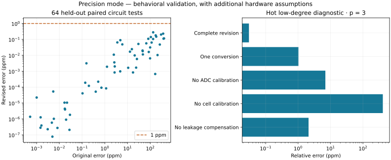

# Revised circuit: measured simulation results

See [design and assumptions](PRECISION_REVISION.md). No physical chip measurements are claimed.

Held-out inputs: 64. Below 1 ppm: 64. Improved over paired original: 64.
Worst original error: 403.5050 ppm. Worst revised error: 0.2789 ppm.

| p | X | °C | Original error ppm | Revised error ppm |
|---:|---:|---:|---:|---:|
| 3 | 1e-300 | -20 | 114.729 | 0.0634794 |
| 3 | 0.037 | 25 | 263.177 | 0.0475434 |
| 3 | 1.000001 | 85 | 183.405 | 0.148746 |
| 3 | 1e+300 | -20 | 298.883 | 0.20168 |
| 4 | 1e-300 | 25 | 106.17 | 0.140577 |
| 4 | 0.037 | 85 | 403.505 | 0.115566 |
| 4 | 1.000001 | -20 | 3.56471 | 0.0645628 |
| 4 | 1e+300 | 25 | 173.76 | 0.178624 |
| 5 | 1e-300 | 85 | 134.157 | 0.278918 |
| 5 | 0.037 | -20 | 81.86 | 0.109103 |
| 5 | 1.000001 | 25 | 5.90355 | 0.0486289 |
| 5 | 1e+300 | 85 | 383.214 | 0.111709 |
| 7 | 1e-300 | -20 | 85.8854 | 0.0162729 |
| 7 | 0.037 | 25 | 209.081 | 0.0103934 |
| 7 | 1.000001 | 85 | 98.2254 | 0.0064345 |
| 7 | 1e+300 | -20 | 133.296 | 0.10592 |
| 16 | 1e-300 | 25 | 12.7952 | 0.0169022 |
| 16 | 0.037 | 85 | 98.8081 | 0.0313026 |
| 16 | 1.000001 | -20 | 4.83085 | 0.0894295 |
| 16 | 1e+300 | 25 | 66.9085 | 0.0565057 |
| 31 | 1e-300 | 85 | 45.8616 | 0.0199832 |
| 31 | 0.037 | -20 | 47.2606 | 0.0113808 |
| 31 | 1.000001 | 25 | 2.49335 | 0.0109479 |
| 31 | 1e+300 | 85 | 46.4475 | 0.0182839 |
| 127 | 1e-300 | -20 | 2.62949 | 0.00359485 |
| 127 | 0.037 | 25 | 20.6476 | 0.00987881 |
| 127 | 1.000001 | 85 | 10.7009 | 0.00164608 |
| 127 | 1e+300 | -20 | 25.894 | 0.00587037 |
| 257 | 1e-300 | 25 | 0.155552 | 0.0031462 |
| 257 | 0.037 | 85 | 17.4204 | 0.000836611 |
| 257 | 1.000001 | -20 | 1.25072 | 0.00191756 |
| 257 | 1e+300 | 25 | 4.76848 | 0.000980727 |
| 4095 | 1e-300 | 85 | 0.399277 | 5.18376e-05 |
| 4095 | 0.037 | -20 | 0.513409 | 0.000219573 |
| 4095 | 1.000001 | 25 | 0.104578 | 4.06904e-05 |
| 4095 | 1e+300 | 85 | 1.14517 | 8.33763e-05 |
| 65537 | 1e-300 | -20 | 0.00100517 | 2.22448e-05 |
| 65537 | 0.037 | 25 | 0.0198321 | 9.02145e-07 |
| 65537 | 1.000001 | 85 | 0.0293515 | 1.82241e-06 |
| 65537 | 1e+300 | -20 | 0.0217458 | 1.05711e-05 |
| 983039 | 1e-300 | 25 | 0.00148026 | 2.80306e-07 |
| 983039 | 0.037 | 85 | 0.00824624 | 2.73265e-07 |
| 983039 | 1.000001 | -20 | 0.00163083 | 3.89089e-07 |
| 983039 | 1e+300 | 25 | 0.00573427 | 1.0238e-06 |
| 1000000 | 1e-300 | 85 | 0.001501 | 1.26718e-06 |
| 1000000 | 0.037 | -20 | 0.00468474 | 5.84079e-07 |
| 1000000 | 1.000001 | 25 | 0.000519799 | 1.37392e-06 |
| 1000000 | 1e+300 | 85 | 0.00308015 | 2.26119e-07 |
| 528 | 7.5050719e+161 | -20 | 0.709945 | 9.20911e-05 |
| 3 | 1.4352456e-256 | 25 | 369.692 | 0.230182 |
| 97389 | 2.6086667e+17 | 85 | 0.0168528 | 1.05795e-05 |
| 7 | 4.4120814e-156 | -20 | 165.02 | 0.000669578 |
| 6 | 5.7531886e-152 | 25 | 30.047 | 0.0517791 |
| 242625 | 2.941168e+33 | 85 | 0.0178044 | 3.93013e-06 |
| 8 | 1.311632e+26 | -20 | 15.528 | 0.0243842 |
| 12578 | 9.2659277e-36 | 25 | 0.199386 | 0.000120728 |
| 34703 | 3.5372966e-209 | 85 | 0.027877 | 2.06652e-07 |
| 210083 | 6.9672598e+196 | -20 | 0.0174187 | 4.43395e-06 |
| 5788 | 5.5024802e+116 | 25 | 0.138126 | 0.000189157 |
| 928 | 1.0783253e-245 | 85 | 2.69065 | 0.000835525 |
| 22739 | 1.3521176e-227 | -20 | 0.00540243 | 5.31488e-05 |
| 433 | 2.2066022e-24 | 25 | 2.73658 | 0.00200441 |
| 186482 | 3.8801651e-92 | 85 | 0.00495259 | 7.71441e-08 |
| 124 | 9.5724971e-262 | -20 | 23.9257 | 0.00168165 |

## Diagnostic ablation at p=3, X=0.037, 85 °C

| Variant | Error ppm |
|:---|---:|
| complete | 0.0305613 |
| one_conversion | 1.02685 |
| no_adc_trim | 6.94319 |
| no_cell_trim | 410.224 |
| no_leak_compensation | 2.10424 |

Controller subsystem: 18 normal completions; 4 injected faults rejected with no transfer. This controller is not integrated into the revised SPICE circuit.

Revised readout: 23.985 ms, plus preparation/programming/calibration; original readout: 2.905 ms.

