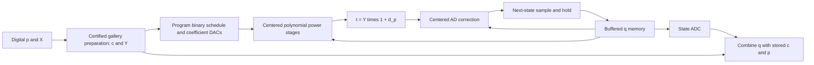
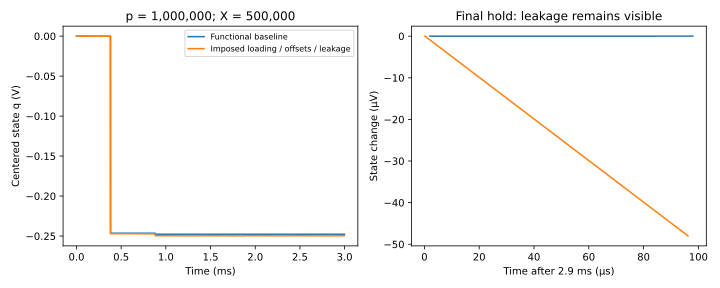
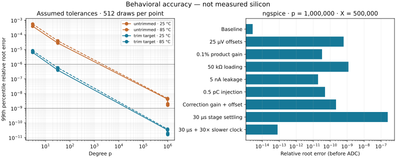

# P5 research: binary-power AD in a centered analog state

**Branch:** `research/analog-fast-ad`, started from `main` at `6f7c9b6`.
This is a new mixed-signal feasibility prototype, not the order-seven research
branch and not a fabricated chip. It retains classical **order-three AD / Halley**.

The required example **p=1,000,000, X=500,000** runs in the behavioral SPICE
prototype. It uses 25 binary power stages and a centered state near −0.248 V.
With the specified loading, offsets and leakage, the reconstructed direct root
has relative error about **1.88×10⁻⁹**, including an idealized 18-bit state ADC.
That precision belongs to a **digital coarse scale plus analog correction**;
it is not the resolution of an ordinary single analog output voltage.

The [engineering follow-up](ENGINEERING_REVIEW.md) now combines timed errors,
implements simulated electrical-reference calibration, and compares full digital
execution. It finds no demonstrated speed advantage and no uniform accuracy
guarantee; see the [measured simulation tables](ENGINEERING_RESULTS.md).

The [generalist and clock study](GENERALIST.md) adds 8,243 input pairs, 296
combined timed runs, 196 successive jobs and continuous/asynchronous-control
experiments. All failures and assumptions are visible in the
[coverage report](GENERALIST_RESULTS.md). A dedicated CI job reruns the campaigns.

## Supported inputs and the meaning of “all p and X”

The algebra applies for positive X and integer p≥3. A finite device cannot
accept an unbounded integer or represent every positive real exactly. This
prototype's programmable envelope is **3≤p≤1,000,000** and a positive finite
binary64 digital X. Tests span X=10⁻³⁰⁰ to 10³⁰⁰; the full continuum and every
binary64 input have not been exhaustively tested. p=1 and p=2 are not covered.
Analog sensor inputs would additionally need acquisition, ADC range selection
and an error budget; those front-end circuits are not implemented here.

P and X enter through a controller. The controller uses the gallery's actual
`initializeCalibrated(..., 'compact')` code: certified dyadic comparisons find c
with 1≤Xc^p≤2, and produce a rounded Y≈Xc^p. This uses 128-bit interval arithmetic
and binary powering, **not a root/log/exp oracle**. We retain the narrow band
because it bounds the circuit signals better than the gallery's wide visual band.

The preparation already performs substantial digital work. In the required
example it makes 22 comparisons and returns

    c = 0.9999871253967285
    Y = 1.28104637891846

Using 1/c alone already has relative error 2.477×10⁻⁷. The analog loop refines
that initial approximation; its stressed result improves it by roughly 132 times.
A speed/energy comparison must include initialization and data conversion.
The gallery's “calibration” is numerical normalization, **not physical offset,
gain, temperature or component calibration**. No factory calibration is claimed.

## Why direct voltage encoding is insufficient at high degree

If u≈1 encodes the prepared reciprocal state, then

    d(log t)/du = p/u,        t=Y u^p.

An additive 25 µV error at a one-volt unit scale changes log t by about 25
when p=1,000,000: approximately exp(25) amplification of the residual. Binary
powering reduces multiplication count; it does not remove this conditioning.

Instead store the centered variable

    q=p(u−1),     u=1+q/p,     q0=0.

Now d(log t)/dq=1/u. The same 25 µV q error changes log t by only about
25×10⁻⁶ near u=1. The voltage scale is one volt per unit q. This is an exact
change of state coordinates, not a replacement of the AD iteration by Newton
on logarithms or a hidden exponential circuit.

## Exact binary power without subtracting nearly equal voltages

For a partial exponent n define

    d_n = (p/n)(u^n−1),      d_1=q.

The binary schedule uses two polynomial updates:

    d_(2n) = d_n + [n/(2p)] d_n²,
    d_(n+1) = d_n + (q−d_n)/(n+1) + [n/(p(n+1))] d_n q.

At the final n=p, **u^p=1+d_p**. These identities are exact; small weights are
applied after the product, rather than reconstructing u≈1 before every multiply.
The schedule has floor(log₂p)+popcount(p)−1 operations: 25 for p=1,000,000,
and at most 37 over the stated degree range. A 20-bit p register is sufficient.
The controller programs bounded coefficients; their finite resolution is
examined separately in `precision.py`, not silently assumed perfect hardware.

For the exact initialized AD orbit, Y∈[1,2] gives u∈[Y^(−1/p),1]. Hence
−ln 2<q≤0 and q≤d_n≤0 for 1≤n≤p. The latter follows from
(1−u^n)/(n(1−u))≤1. Thus the ideal centered power chain fits comfortably inside
the ±2 V behavioral signal rails independently of p. Circuit errors can violate
ideal invariants; the simulator separately checks rail/denominator margins.

## Same AD update, better state representation

Let t=Y(1+d_p). The exact centered AD step is

    q+ = q + 2(1+q/p)(1−t) / [1+t+(t−1)/p].

It equals p(u C_AD(t)−1), with
C_AD=(p+1+(p−1)t)/(p−1+(p+1)t). It retains cubic local order and the original
positive-state convergence in exact arithmetic. Inexact hardware need not
converge to the exact fixed point: the stress simulations visibly reach an
error floor.

The direct-root result is reconstructed as

    result = 1 / [c(1+q/p)].

A controller can combine the stored c with the digitized q. Large output
magnitudes require a mantissa/exponent representation or separate range setting.
A low-resolution DAC producing only the final voltage would lose much of this
fine correction. No such high-resolution final-output DAC is simulated.



## What the SPICE circuit actually contains

`spice.py` generates **unrolled** behavioral stages for the chosen p. Reusing
one physical multiplier over 25 clocked micro-operations is a future design;
this simulation does not claim that area saving. A general unrolled design
would need up to 37 programmable stages, bypass multiplexers and a sequencer;
the generator configures a fresh netlist, not fabricated programmable switches.

The generated netlists contain no root, exponential, logarithm or arbitrary
power operator. They use additions, products, divisions, buffers and explicit
sample/hold switches/capacitors. The stages are custom behavioral sources with
one-pole settling, not transistor or manufacturer macromodels.

- A 10 nF state capacitor and a separate 10 nF next-state capacitor prevent
  continuous feedback from being mistaken for a discrete AD step.
- Ideal nonoverlapping control pulses: reset first 10 µs; next-state sampling
  at 350–360 µs, transfer at 380–390 µs, repeated every 500 µs, six cycles.
  These are imposed timing choices, not measured maximum speed.
- Functional output resistance 10 Ω, capacitance 100 nF (nominal 1 µs time
  constant), and 2 pF port capacitance are explicitly modeled.
- Baseline: essentially unloaded ports (10¹² Ω), zero imposed offsets/gain error
  and zero current leakage. Finite resistances, settling and switches remain.
- Stress: 50 kΩ ports, +25 µV read/product/summer offsets, +0.1% product gain
  error and +5 nA state-capacitor leakage. This is one correlated deterministic
  scenario, **not** a worst-case or Monte Carlo specification.
- Arithmetic target clipping at ±2 V and a denominator floor at 0.25 V are
  numerical guards, not implemented protection circuits. All seven runs stay
  clear of these guards; monitored stage-drive peaks are exported.
- State ADC: ideal rounding on ±2 V with 18 bits in postprocessing. Coefficient
  quantization is a separate algorithm experiment; the SPICE coefficients and
  Y source are exact programmed constants, not DAC device models.

The 50 kΩ loading scale is motivated by the [AD734 data sheet](https://www.analog.com/media/en/technical-documentation/data-sheets/ad734.pdf),
but none of these error/timing assumptions constitutes an AD734 model or a
promised IC specification. In particular, this is not the calibrated P4 chain
with its manufacturer-port allocation validated. See the
[ngspice manual](https://ngspice.sourceforge.io/docs.html) for the behavioral-source
and transient-simulation primitives used here.

## Results and interpretation

Seven SPICE runs cover p=3,32,1,000,000, each with baseline and stress, plus a
four-times-smaller maximum timestep for the million-degree stressed example.
Measurements use the full output, at 405 µs after reset and after each 500 µs
cycle; committed CSVs are thinned only for plots. All values are reproducible
in `spice_results.json`.

| p | Original X | Stress: relative error after ideal 18-bit q ADC |
|---:|---:|---:|
| 3 | 2 | about 2.11×10⁻⁴ |
| 32 | 500,000 | about 2.16×10⁻⁵ |
| 1,000,000 | 500,000 | about 1.88×10⁻⁹ |

For the million-degree baseline, the corresponding ADC-limited error is about
3.47×10⁻¹². That is a functional-model figure, not a proposed silicon accuracy.
Stress shifts q from approximately −0.247677 to −0.249557 V; its small decoded
root error comes from division by p and the retained digital coarse scale.
At low p the same analog errors produce much larger output errors. Therefore
we have **not** established one uniform precision specification for all p.

The stressed final hold drifts by approximately −37.5 µV over 75 µs, consistent
with 5 nA on 10 nF. Buffering isolates the capacitor from resistive port loads,
but does not remove leakage. The independent reduced-timestep run checks the
final q agreement, with a 20 µV tolerance recorded in the script.



Other checks: 35 prepared algorithm cases over seven degrees and five input
magnitudes, 70 deterministic arithmetic-error cases, 49 independent power
checks, and 36 finite-coefficient-resolution cases. The 100-digit reference
root is used only to score the results, never to prepare or iterate the state.

## Formal scope, reproduction and next engineering step

`LeanMath/Papers/AnalogFastAD.lean` certifies the two centered binary recurrences,
AD state conjugacy, normalization identity, decoding algebra and additive
error scaling. These algebraic certificates do not certify an ADC, a transistor
or the global stability of the inexact circuit. The original gallery preparation
and fast-power proofs remain separate and unchanged.

```sh
python -m pip install numpy sympy mpmath matplotlib
node research/analog_fast_ad/prepare.mjs
python research/analog_fast_ad/verify.py
python research/analog_fast_ad/model.py
python research/analog_fast_ad/precision.py
python research/analog_fast_ad/spice.py  # requires ngspice
python research/analog_fast_ad/plot.py
lake build LeanMath.Papers.AnalogFastAD
python scripts/audit_analog_fast_ad.py
```

The next useful hardware step is to build and measure **one centered multiply-
accumulate cell plus buffered sample/hold**, including small programmable gains.
Then validate an actual sequencer, DAC/ADC interfaces, independent mismatch,
thermal noise, temperature drift and settling before choosing a fabrication PDK.
There is no layout, foundry sign-off, measured power/energy/area, or fabricated
chip in this deliverable. The prototype establishes a testable architecture
and the requested large-p functional example, not an unrestricted physical machine.

## Accuracy characterization (follow-up)

The [full tolerance report](CHARACTERIZATION.md), [assumptions and engineering
limits](HARDWARE_ACCURACY.md), and machine-readable results now separate error
sources. They cover 49,152 joint behavioral samples, 24,576 isolated-source
samples and additional timed ngspice sensitivity runs. The `trim_target` profile
is a proposed set of residual specifications, **not an implemented calibration**.



At X=500,000 and 25 °C, the joint-model 99th-percentile errors are:

| p | Untrimmed assumptions | Proposed tighter tolerances |
|---:|---:|---:|
| 3 | 3.83×10⁻⁴ | 6.35×10⁻⁶ |
| 32 | 2.74×10⁻⁵ | 3.91×10⁻⁷ |
| 1,000,000 | 1.60×10⁻⁹ | 1.59×10⁻¹¹ |

These are finite sampled percentiles under the stated synthetic distributions,
not yield predictions or guaranteed accuracy. Even the tighter profile misses
one ppm at low p. Buffered interstage loading, arithmetic offset/gain trimming,
converter linearity and sample timing need explicit hardware specifications.

```sh
python research/analog_fast_ad/characterize.py
python research/analog_fast_ad/characterize_spice.py
python research/analog_fast_ad/plot_accuracy.py
```

## Calibrated precision mode

The [precision revision](PRECISION_REVISION.md) adds 100 nF storage, longer
acquisition, electrically calibrated leakage compensation, a calibrated 24-bit
ADC and averaging of 16 readouts. In [64 held-out paired behavioral tests](PRECISION_REVISION_RESULTS.md),
all revised results are below 1 ppm; the worst is 0.279 ppm, versus 404 ppm
for the original circuit on those inputs. The readout takes about 24 ms,
excluding preparation and calibration. These results depend on the documented
reference, trim and converter assumptions; they do not establish physical chip
performance or a universal accuracy guarantee.

A separate noisy completion-controller model completes 18 normal jobs and
blocks transfers in four injected-fault tests. It is not yet integrated with the
revised SPICE circuit. The dedicated precision CI job repeats both studies.
