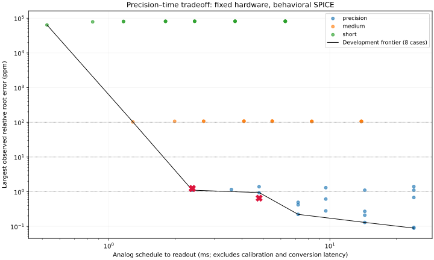

# Precision–time study

This study changes the schedule and readout policy, retaining the calibrated precision circuit: 100 nF memories, 230 ohm switches, 24-bit coefficients/ADC and the same noise assumptions. It does not accelerate analog components or shrink their modeled time constants.

## Protocol

Five schedules are explored on eight development inputs (p=3,7,983039,1000000; X=2 or 500000). Each schedule runs twenty iterations. Fixed policies read prefixes of 2,3,4,6,8,12 or 20 iterations and average 1,2,4,8 or 16 states where allowed. This prefix scoring avoids rerunning identical trajectories; it is not an oracle-controlled stopping rule. Different prefixes are correlated, not independent trials.

The fastest development policy meeting each target is frozen before testing eighteen new inputs (six degrees, X=0.037,1e-200,1e200), with three temperatures and new noise/calibration seeds. Failed simulations and held-out accuracy misses remain in the JSON. Each selected policy is checked with a four-times-finer timestep on its worst completed validation case.

| Target | Selected schedule | Iterations / averaged | Time (ms) | Held-out passes | Worst held-out error (ppm) |
|---:|:---|---:|---:|---:|---:|
| 100 ppm | precision | 2 / 1 | 2.385 | 18/18 | 1.2381 |
| 10 ppm | precision | 2 / 1 | 2.385 | 18/18 | 1.2381 |
| 1 ppm | precision | 4 / 2 | 4.785 | 18/18 | 0.65231 |

Crimson crosses are held-out maxima; the black line connects development policies for readability, not an interpolated guarantee.

## Failures and numerical checks

Development: 25/40 trajectories completed without a range/denominator rejection. Validation: 18/18. Finer-timestep checks: 2, each with a relative-error change below 0.1 ppm.

## What is timed, and what preconditioning means

The analog time is the configured time from the prepared job/reset to the last required state sample. It is not ngspice execution time and does not include supply startup, electrical calibration, input preparation, coefficient programming, ADC conversion latency or final digital decoding. Therefore these numbers remain lower estimates of end-to-end physical latency. The ADC is a sampled transfer model, not a timed converter.

Powering the circuit beforehand eliminates power-up delay, but does not eliminate voltage changes after a new input. The hold and arithmetic states must settle to new values. Keeping the previous answer can help nearby inputs but may hurt large jumps; this study starts each job with its prescribed q=0 preparation and does not claim a warm-state streaming measurement. The older ideal streaming study retains stage states but omits the revised circuit errors.

The repository CPU benchmark is warmed up and uses varying inputs. Its approximately 13 ns per exp(log(X)/p) call is an amortized host-loop time, not an isolated dependent latency measurement or a universal processor specification. It is not directly equivalent to the analog schedule. No speed or energy advantage is established.

## Scope and interpretation

The reference root is used only for scoring. Electrical calibration uses known reference voltages and is repeated for each temperature/schedule. No calibration or coefficient programming time is charged. High degrees benefit from digital preparation and from root-error sensitivity proportional to roughly 1/p; accuracy at p=1000000 alone would be a weak test. The low-degree cases are essential.

The plotted frontier is finite-sample evidence, not an optimum over all analog circuits or an all-input accuracy bound. Large memory, leakage compensation, precision references and idealized arithmetic transfer laws retain the limitations documented in PRECISION_REVISION.md. There is no transistor/PDK validation or measured chip.

Reproduce with `python research/analog_fast_ad/speed_accuracy.py` then `python research/analog_fast_ad/speed_accuracy_report.py`.

## Retrospective robustness check

The selected early-readout policies were also scored on the existing 64 precision-mode trajectories. These are reused historical data, not another independent validation campaign.
- 2 iterations, 1 averaged: 64/64 below 10 ppm; largest error 1.9023 ppm.
- 4 iterations, 2 averaged: 64/64 below 1 ppm; largest error 0.98156 ppm.

The four-iteration policy has little margin to 1 ppm on the historical set. The longer precision mode remains available; early readout is not a replacement accuracy guarantee.
