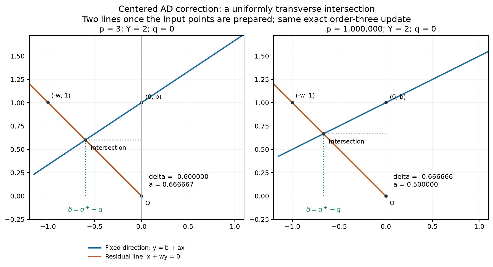

# Centered AD geometry designed for an analog correction cell

This research note uses the V30 circuit experience to redesign the geometric **correction stage** of fast-power Pandrosion AD. It preserves the exact order-three update and the existing centered binary-power module. It proposes a compact intersection and an equivalent feedback equation, with written bounds and reproducible ideal checks. The subsequent **[paired SPICE study](SIMULATION_RESULTS.md)** implements the proposal and compares it to the V30 equation baseline and a matched direct cell. See the [frozen simulation protocol](SIMULATION_PROTOCOL.md), [model topology](comparison_topology.png), and [results plot](comparison_results.png). No Lean proof, complete trace count or fabricated-hardware improvement is claimed.

The recorded study finds a **24% shorter isolated settling time** for the calibrated cubic full step, with overshoot, but **no complete-calculator speed advantage over the V30 model** at 1 ppm: the new feedback policy passes 60/64 held-out cases at 2.385 ms versus 64/64 for V30. It is an implementation candidate, not a validated replacement. Explicit port-load losses increase; total chip energy and area remain unmodeled.



## What the circuit experiments suggest

The [precision ablation](../analog_fast_ad/PRECISION_REVISION_RESULTS.md) found 410.224 ppm without cell trimming, 6.94319 ppm without ADC trimming and 2.10424 ppm without leakage compensation, versus 0.0305613 ppm for the full system, in one diagnostic case (`p=3, X=0.037, 85 °C`). These are case-specific effects, not universal error budgets. The [timing study](../analog_fast_ad/SPEED_ACCURACY.md) also shows that shortening acquisition with unchanged components can lose accuracy.

The useful geometric objectives are therefore bounded signals, well-separated intersection directions, explicit coefficient sensitivities, short dependency paths and limited state storage. Few drawn lines do not determine electrical latency, area or power.

## Exact correction as an intersection

Retain the V30 preparation and notation:

- `s=c u`, `Y=X c^p`, with ideal `1≤Y≤2`;
- centered state `q=p(u−1)`, initially `q=0`;
- the existing centered binary stage gives `t=Y u^p`;
- define `w=t−1`, `a=(p+1)/(2p)`, `b=1+q/p`, and output increment `δ=q⁺−q`.

The centered AD identity gives exactly

```
δ = 2(1+q/p)(1−t) / [1+t+(t−1)/p]
  = −w b / (1+a w).
```

Construct the following two lines in a local Cartesian frame:

```
L_support:   y = b + a x
L_residual:  x + w y = 0.
```

The first passes through `(0,b)` with a direction prepared for the given degree. The second joins the fixed origin to the input point `(-w,1)`. Their intersection has

```
x = δ = −w b/(1+a w),       y = b/(1+a w).
```

Then add the read increment to the stored state: `q⁺=q+δ`. At the root, `w=0`, the residual line is vertical and the intersection is `(0,b)`: this chart has no singularity at convergence.

This is a two-line **readout gadget after its input points have been constructed**. Construction of `w`, `b`, the parallel through `(0,b)`, scales, the final addition and the full power stage still require an explicit protocol before a trace comparison can be made. The figure does not claim an entire two-line root iteration.

## Written uniform bounds on the initialized ideal orbit

The original AD invariance gives `Y^(−1/p)≤u≤1`. Hence, for integer `p≥3`,

```
0≤w≤1,   1/2≤a≤2/3,   2^(−1/3)≤b≤1,   −log 2<q≤0.
```

The intersection determinant is `1+a w∈[1,5/3]`. The points satisfy

```
−2/3≤δ≤0,           (3/5) 2^(−1/3)≤y≤1.
```

Indeed `w/(1+a w)≤w/(1+w/2)≤2/3`, while `b/(1+a w)≥(3/5)2^(−1/3)`. The input anchors also remain bounded: `(-w,1)∈[-1,0]×{1}`, `(0,b)∈{0}×[2^(−1/3),1]`. These bounds are independent of degree and of the original `X` after the existing preparation.

For the acute angle `θ` between directions `(1,a)` and `(-w,1)`,

```
sin θ = (1+a w) / sqrt((1+a²)(1+w²)) ≥ 3/sqrt(13),
θ ≥ 56.3099 degrees.
```

To prove the inequality, expand

```
(1+a w)² − (1+w²) = w [2a − (1−a²)w] ≥ 0.
```

Here `w∈[0,1]` and `a∈[1/2,2/3]` make the bracket nonnegative. Divide by `(1+a²)(1+w²)` and use `1+a²≤13/9`. Thus the two directions never approach parallelism on this ideal orbit.

These are bounds for this local correction chart. They do not establish uniform conditioning of the input-acquisition circuit, the entire binary chain, or the original rectangle drawing. The V30 centered scalar correction already has the same nonvanishing denominator; this is a new geometric realization and candidate topology, not a new improvement of the intrinsic scalar-map condition number.

## Equivalent analog feedback equation

The incidence can also be written

```
δ = −w (b+aδ).
```

A candidate cell uses a weighted summer and a multiplier in feedback, with `q` and `w` held during the correction. It realizes the quotient implicitly; it does not eliminate the physical work of division. Multiplier-feedback division is classical: see [Analog Devices AD734, Operation as a Divider, page 14](https://www.analog.com/media/en/technical-documentation/data-sheets/ad734.pdf).

For **frozen inputs** the algebraic fixed-point map `δ↦−w(b+aδ)` has contraction factor `a w≤2/3`. In an ideal one-pole model

```
τ δ_dot = −δ − w(b+aδ),
```

the error decays with time constant `τ/(1+a w)`. Neither statement proves stability or settling of a real multipole circuit. Loading, delay, bandwidth, coefficient programming, offsets and saturation must be modeled. Continuously changing `q` and `w` instead of holding them would also change this analysis and would not automatically preserve discrete Halley order.

The simulation below gives **both** the summer and the multiplier their own pole. For ideal unit static gains and frozen inputs, the characteristic polynomial is then

```
(τ₁ z+1)(τ₂ z+1)+a w.
```

It has roots with negative real parts when `τ₁,τ₂>0` and `1+a w>0`. For equal poles and `w>0`, its roots are `(-1 ± i sqrt(a w))/τ`: the decay envelope is no longer the one-pole prediction, and the output may overshoot. This explains why the SPICE study measures settling and overshoot separately. The argument does not cover additional device poles, delay or moving inputs.

Static sensitivities, holding other inputs independent, are

```
∂δ/∂w = −b/(1+a w)²,       |∂δ/∂w|≤1,
∂δ/∂b = −w/(1+a w),         |∂δ/∂b|≤2/3,
∂δ/∂a = b w²/(1+a w)²,     |∂δ/∂a|≤4/9.
```

The residual `w=(Y−1)+Y d_p` still cancels near the root and remains offset-sensitive. An output offset, memory drift or inaccurate coefficient can still impose an error floor. The bounded chart does not remove the calibration and readout issues observed in V30.

## Geometry checks and electrical comparison

Run from the repository root:

```
python3 research/analog_geometry_ad/verify.py
```

SymPy checks equivalence with centered AD, the incidence identity and sensitivity derivatives. At 120 decimal digits, 200 intersections cover eight degrees (`3` through `10^6`), five normalized inputs and five positions in the ideal invariant interval. The reference root is used only to sample that interval and score the checks, not to initialize an algorithm. The tests verify the coordinate, angle and frozen-feedback bounds, and preserve the results in `checks.json`.

The paired correction-cell comparison is now implemented in [campaign.py](campaign.py), using the same power chain, state memory, loads, acquisition schedule and precision target. Added cells receive electrical-reference calibration under the same stated measurement/trim budget. Sweep low degrees, large degrees, residuals close to zero, temperature and perturbations. Measure error, settling, wrong transfers, memory count and, once physical devices are specified, energy and area. Measured behavioral settling and full-calculator accuracy are reported separately in [SIMULATION_RESULTS.md](SIMULATION_RESULTS.md); total chip energy and area remain outside the model.
