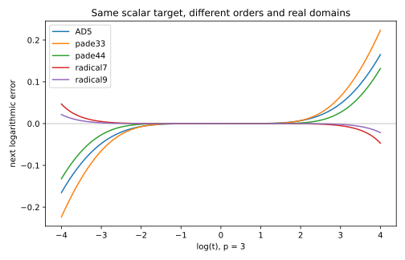

# Geometric factorization of reciprocal-root corrections

> **Follow-up:** the [global order-seven protocol](../global_order7/README.md) now
> supplies an explicit twelve-join correction with rational preparation. It
> resolves the comparable-expanded-cost question left open in Q5 below.
> This document records the earlier search; its statement that no economical
> order-seven protocol had been established is superseded by that follow-up.

Research extension to V20, 19 September 2026. The V20 manuscript and its frozen
axiom audit are unchanged. The results here concern exact real geometry;
numerical surveys are explicitly distinguished from proofs.

## Findings and answers to Q1–Q8

1. **Is the V20 transport optimal?** No general optimality theorem is established.
   A concrete counterexample to universal mobile-cost optimality is Halley:
   a fixed oblique rail and the existing power-chain horizontal give the same
   correction with **2J+(2p+1)P**, instead of **3J+(2p+1)P+1C**. Preparation and
   intersection angles must also be compared; this is not universal Pareto domination.
2. **Can AD5 be cheaper or better conditioned?** The completed fixed-support
   AD5 protocol adds one parallel. It does not beat V20's mobile cost or its
   final readout conditioning in the reference example. A Cayley gauge gives a
   uniformly transverse, bounded circle core, but no cheaper complete protocol
   or global conditioning theorem has been obtained. AD5 optimality remains open.
3. **Fixed support without a cost increase?** Yes for Newton (identical geometry)
   and Halley with the native telescope. The explicit projective and AD5 duals
   trade a join or add a parallel; they are not general cost improvements.
4. **Maximum with one radical?** Exactly 7 in `D=a+c√(1+d z²)`, and exactly 9 in
   `D=a+b z²+c√(1+d z²)`, for p≥3, with `C=(D−z)/(D+z)` and
   `z=(t−1)/(t+1)`. This is a maximum in each stated ansatz, not under all
   possible ruler-and-compass programs. Both solutions have restricted real domains.
5. **Order 7 at V20 AD5 cost?** Order 7 is constructible with one shared radical,
   but no complete protocol with a comparable J/P/C count has been established.
   Counting radicals alone cannot answer this question.
6. **Order 9?** Yes in the second ansatz above, with an additional quadratic
   rational stage. Rational Padé [4/4] also has order 9. Neither observation
   establishes an economical new geometric method. Two radicals yield exact
   local order 11 for p=3,4,5,7 in the tested family, but already fail global reality.
7. **Which are global?** The four V20 maps retain their scalar convergence under
   every admissible gauge. Diagonal Padé [3/3] and [4/4] have global monotone
   convergence by the argument below. The new one-radical 7/9 maps are not even
   real for every positive t. Nearby non-diagonal Padé controls can be negative.
8. **What does reciprocity buy?** `C(1/t)=1/C(t)` makes the logarithmic error
   odd and reduces the coefficient problem to even D. It does not bound the
   attainable odd order. Nonreciprocal Padé controls supply even orders 6 and 8.

## Exact geometry, terminology and baseline

See [derivation](derivation.md) for the incidence calculation and
[AD5 protocols](ad5_factorizations.md) for explicit joins, rails, circle branch
selection and the full scaled family. The precise freedom is homogeneous
scaling of the pair `[κ:r]`; it is not an arbitrary projectivity of the plane.

Put N=p+1+(p−1)t, D=p−1+(p+1)t,
U=2p((2p−1)t+p+1), V=(p+1)t+5p−1, and
Q=(p+1)t²+2(2p−1)(p+1)t+(2p−1)(p−1).
For AD5 put
`g=(p−1)√(((p−2)(t²+1)+(10p+4)t)/(12p))`.

| Baseline | Order | C | κ | r | Geometric source of κ |
|---|---:|---|---|---|---|
| AK | 2 | p/(p−1+t) | p | 1−t | fixed AK |
| centered AD | 3 | N/D | N/2 | 1−t | centered arc and support join |
| projective AD [2/1] | 4 | U/Q | U/V | 1−t | projection and support join |
| decentered AD5 | 5 | (1+g)/(t+g) | 1+g | 1−t | decentered circle and support join |

In each row ME supplies r. In the duals AK is fixed and MR supplies
`r=p(1−1/C)`. In particular **Halley's numerator is 2p(1−t)**, not
(p+1)(1−t). This algebraic correction matters for p≠1.

J denotes one join, P one parallel, C one mobile circle/arc, as in V20.
The final horizontal is charged as a parallel. V20's expanded convention is
P=2J+3C; it is a declared macro convention, not a universal physical cost.
Circle-line intersection queries, fixed circles, and mobile arcs are separate
quantities even when the following completed protocols each use one query per arc.

| Completed construction | Order | Native total J | Native total P | C / radical queries | Correction after binary power (J,P,C) | Additional fixed preparation |
|---|---:|---:|---:|---:|---|---|
| AK / dual Newton | 2 | 2 | 2p+1 | 0 | (1,2,0) | AK, M |
| AD | 3 | 3 | 2p+1 | 1 | (2,2,1) | centered-arc anchors, M |
| projective AD | 4 | 4 | 2p+1 | 0 | (3,2,0) | projective center/rail, M |
| AD5 | 5 | 3 | 2p+1 | 1 | (2,2,1) | decentered center and radius anchor, M |
| dual Halley | 3 | 2 | 2p+1 | 0 | (1,3,0) | AK, oblique rail, M |
| dual projective | 4 | 3 | 2p+2 | 0 | (2,4,0) | AK, center, horizontal rail, M |
| dual AD5 | 5 | 3 | 2p+2 | 1 | (2,4,1) | AK, scaled-radius center/anchors, horizontal rail, M |

For binary power, add mJ+(m+b)P, where b=floor(log₂p) and
m=b+popcount(p)−1. The native telescope already supplies E's horizontal;
binary power does not, hence the extra P for each nontrivial dual. The exact
λ=1 radius shortcut saves one J in dual AD5; the table gives the generic chart.

Fixed-object counts in `geometry_results.json` describe the implemented
prepared diagram, excluding O,A,B,C and the current P. They are not minimum
preparation costs. All constants in the four protocols are rational functions
and square roots of p,X,W,H, so preparation is constructible when those input
lengths are supplied; arbitrary real inputs are treated as given lengths.
Large X, large 1/X, p-dependent anchors and the λ≈1 radius-scaling center can
still produce large coordinates. No bound uniform in all inputs is asserted.

## Search and exact local-order certificates

Set a=X^(−1/p), e=log(s/a), so t=exp(pe) and z=tanh(pe/2).
The target Cayley denominator is

    D*(z)=z/tanh(atanh(z)/p).

Its coefficients are computed exactly from
`p(1−z²)w′=1−w²`, w=(1−C)/(1+C). The script solves finite coefficient
systems over rational functions of symbolic p, without floating-point fitting.

For the order-7 family:

    a=3p(p²+1)/(2(4p²−1)),
    c=5p(p²−1)/(2(4p²−1)),
    d=−4(4p²−1)/(15p²).

For order 9:

    a=3p(71p⁴+90p²−26)/(5(11p²−2)²),
    b=(p²−4)(p²−1)/(15p(11p²−2)),
    c=98p(p²−1)(4p²−1)/(5(11p²−2)²),
    d=−2(11p²−2)/(21p²).

Use κ=D−z, r=−2z. The radical is shared; do not count it twice because it
appears in both numerator and denominator of C. The exact next unmatched
coefficients of D−D* are respectively

    Δ6=−(p²−4)(p²−1)(4p²−1)/(4725p⁵),
    Δ8=−(p²−4)(p²−1)(4p²−1)(29p²−4)/(396900p⁷).

Matching the preceding coefficients uniquely fixes these parameters in each
nondegenerate ansatz. Both defects are nonzero for p≥3, obstructing higher
order in that ansatz. If D−D*=Δ z^(2m)+O(z^(2m+2)), differentiation of
log((D−z)/(D+z)) with respect to D gives

    e+ = Δ p^(2m−1) e^(2m+1)/2^(2m) + O(e^(2m+3)).

The functions are analytic near z=0, with positive radical and D(0)=p;
therefore the finite jet calculation proves local order, rather than merely
fitting observed slopes. For p=3 the order-7 coefficient is −1/216.

For p>2, respectively `1+d=−(p²−4)/(15p²)` and
`1+d=−(p²−4)/(21p²)`. Thus each radicand is negative near z=±1.
The strict real interval is |z|<1/√(−d), equivalently a finite reciprocal
interval of t. The explicit p=3,t=1000 counterexamples are also checked in
Lean. Dyadic normalization preserves t and cannot repair this obstruction.

The two-radical search matches D through z⁸ at p=3,4,5,7. At p=3 the
radicand coefficients are −106/135±2√239/135; one is below −1. The nonzero
z¹⁰ defects and exact parameters are in `symbolic_results.json`. This is a
finite-p exploration, not a symbolic-p theorem or an optimized geometric circuit.

## Constructibility upper bounds versus actual economical circuits

The completed four dual protocols have actual counts above. For other gauges
and higher-order ansätze we can give explicit, deliberately loose arithmetic
constructions, **not** pretend that their scalar operation count equals traces.
Use a signed x-axis, a signed y-axis, the unit points and fixed ±45° directions.
A diagonal parallel transfers a scalar between axes. The intercept theorem
multiplies a and b by joining (1,0) to (0,b) and drawing its parallel through
(a,0); transfer the resulting ordinate to the x-axis. Division b/a uses the
join (a,0)(0,b) and a parallel through (1,0). These cost at most 1J+3P including
axis transfers. Addition uses the horizontal/vertical intersection (a,b) and a
−45° transfer, at most 4P including the transfer of b. Negation and subtraction
can be included in a common conservative bound of **1J+6P per arithmetic gate**.
Zero operands use the already known zero point; division requires a nonzero divisor.

For q≥0, the circle with diameter endpoints (−1,0),(q,0) intersects the
vertical x=0 at ordinates ±√q. Its center and radius are (q−1)/2 and (q+1)/2.
Four arithmetic gates, one mobile circle, and at most two parallels provide
√q on the scalar axis, with the nonnegative branch selected. This is an explicit
upper bound of 4J+26P+1C, not a minimal square-root construction.

A reproducible loose circuit is: obtain t; form t², αt, q=t²+2αt+1;
construct √q once, then g=β√q; evaluate the chosen h with rational arithmetic;
form κ=h(1+g), r=h(1−t). Finally multiply κ and r by L=H/(WX), place the
support endpoint A+(1,Lκ) and transport endpoint P+(1,Lr), join to A and P,
intersect at T and draw its horizontal. Signed arithmetic handles negative r.
For all explicitly listed rational gauges in `ad5_factorizations.md`, at most
40 arithmetic gates suffice, including these endpoint placements and the
four gates inside the radical macro. Thus a conservative correction-only
bound is **42J+243P+1C**. Constants and their preparation are excluded.
The angle-optimal gauge requires a second radical and separate singular-case
handling; it is not included in this bound.

For D7, first form z=(t−1)/(t+1), z², q=1+d z², √q and D=a+c√q;
for D9 add b z². Then κ=D−z,r=−2z and use the same endpoint/report protocol.
The same 40-gate bound covers both. Two-radical D11 uses the two circles once
each and fits a 50-gate bound, hence **52J+305P+2C**. These large bounds prove
constructibility and expose the missing optimization: they do **not** establish
cost comparability with AD5. Rational Padé can likewise be evaluated by Horner
stages and division using these macros, with increasing joins/parallels.

Consequently “no circle”, “one circle” and “two circles” alone are not finite
operation budgets. There is no finite maximal order for Budget A when rational
stages are unbounded (diagonal Padé). Adding a radical allowance cannot restore
such a bound. A true maximal-order theorem needs bounds on all primitives,
allowed fixed preparation and reuse. The present search does not solve that
unrestricted synthesis problem.

## Global diagonal Padé comparison (written proof, not Lean)

For 0<a=1/p<1 put

    F(t)=(1−t^(−a))/(t−1)
        = ∫₀¹ [1+u(t−1)]⁻¹ dμ(u),
    dμ=(sin(πa)/π)u^a(1−u)^(−a)du.

The identity follows by a beta integral; at t=1 both sides equal a.
Let Fn be n-node Gaussian quadrature for this positive measure and set
Cn=1−(t−1)Fn. Exactness through degree 2n−1 implies that Cn is the diagonal
[n/n] Padé approximant to t^(−a) at 1. Its denominators are positive for t>0.
The quadrature error is strictly positive for t≠1: the 2n-th derivative in u
of the integrand is positive, and the measure has positive mass on (0,1).
Hence Cn>t^(−a) when t>1 and Cn<t^(−a) when t<1. Positive quadrature weights
also give Cn<1 for t>1 and Cn>1 for t<1. Thus Cn is positive, moves s strictly
toward a without crossing it, and has no other positive fixed point. Monotone
bounded iterates and continuity give global convergence. Uniqueness of the
Padé approximation gives Cn(1/t)=1/Cn(t); nonzero quadrature error gives exact
local order 2n+1. This comparison explains why high order alone is not novelty.

The four V20 maps have their established scalar convergence; the duals inherit
it exactly. Newton and projective AD can cross the target and increase the
absolute logarithmic error on one step. This is compatible with their eventual
convergence and must not be called a global failure. The rational [3/2] and
[4/3] controls are negative already at p=3,t=100, so are not globally positive.

## Reproducible falsification and Pareto comparison

`benchmark.py` uses 180 decimal digits, p=3,4,5,7,10,32,100,1000 and 4,800
positive residual samples per map spanning 10⁻¹⁰⁰ to 10¹⁰⁰ plus a dense grid
near 1. Across ten maps this is 48,000 sampled evaluations. Forty-eight
starting orbits per map are capped at 1,000 iterations and |pe|≤10⁶;
reaching a cap is not a proof of divergence. Local orders use two small
logarithmic errors, separately from the exact certificates.

| Map | Nonpositive/nonreal sampled inputs | One-step noncontractions | Crossings |
|---|---:|---:|---:|
| AK | 0 | 1110 | 2400 |
| AD | 0 | 0 | 0 |
| projective AD | 0 | 791 | 2400 |
| AD5 | 0 | 0 | 0 |
| Padé [3/2] | 788 | 4 | 1612 |
| Padé [3/3] | 0 | 0 | 0 |
| Padé [4/3] | 784 | 5 | 1616 |
| Padé [4/4] | 0 | 0 | 0 |
| one-radical order 7 | 1582 | 0 | 3218 |
| one-radical order 9 | 1578 | 0 | 3222 |

Of the 48 scalar starting orbits per map, all finish within the cap for AD
(maximum 120 steps), AD5 (70), diagonal Padé [3/3] (66) and [4/4] (58).
AK reaches the iteration cap in 7 cases, projective AD in 4. Each new radical
map rejects 32 starting orbits; the 16 accepted starts finish within 3 steps.
This comparison uses the specified extreme starting states, not a universal
iteration bound or a cost-normalized efficiency claim.

`geometry_benchmark.mjs` executes 2,100 constructions without exceptions on
p≤32 with native power and p≤1000 with binary power, X∈{1/4,2,4},
t∈{1/8,1/2,1,2,4}, including support levels 1,p,2p for dual AD5.
This modest geometric grid is distinct from the much wider scalar survey.
The maximum readout discrepancy is 2.77×10⁻¹³; the largest tested affine
coordinate is approximately 5,184. These are measured values, not uniform bounds.

The following is a **scenario-specific Pareto table**, p=3,X=2,t=1/2,W=2,H=4.
We minimize J,P,C, fixed objects, max coordinate and final-readout sensitivity,
and maximize order, sine of the final angle and circle margin. No weighted sum
is used. “Retained” only means nondominated among the completed protocols on
this vector in this scenario; it is not a theorem of geometric optimality.

| Method | J,P,C | Fixed points/lines | Max coordinate | sin(final angle) | Final sensitivity | Frontier |
|---|---|---|---:|---:|---:|---|
| AK / dual Newton | 2,7,0 | 2/6 | 4 | .707 | .335 | retained |
| AD | 3,7,1 | 2/6 | 4 | .664 | .349 | retained |
| projective | 4,7,0 | 2/6 | 11 | .658 | .352 | retained |
| AD5 | 3,7,1 | 3/6 | 38 | .656 | .352 | retained |
| dual Halley | 2,7,0 | 2/7 | 4 | .651 | .364 | retained |
| dual projective | 3,8,0 | 3/7 | 11 | .642 | .369 | retained |
| dual AD5, level 1 | 3,8,1 | 6/7 | 38 | .550 | .378 | dominated |
| dual AD5, level p | 3,8,1 | 6/7 | 38 | .640 | .370 | dominated |
| dual AD5, level 2p | 3,8,1 | 6/7 | 38 | .492 | .737 | dominated |

Angle and circle-margin comparisons use an absolute 10⁻¹⁰ tolerance to avoid
classifying binary64 rounding as a strict advantage.
All AD5 margins here are approximately .03025. The dataset also reports center
distance and minimum resolved separation; these do not enter this selected
Pareto vector. Sensitivity perturbs only the coefficients of the final two
lines; it is not an end-to-end perturbation bound. The separation floor is
10⁻¹⁰ times the coordinate scale and excludes unresolved coincidences.

## Prior work and scope of novelty

Newton, Halley, Schröder/Householder and Padé corrections are classical. Relevant
primary sources include [Gander, On Halley's Iteration Method (1985),
DOI 10.1080/00029890.1985.11971554](https://www.tandfonline.com/doi/abs/10.1080/00029890.1985.11971554),
[Scavo and Thoo, On the Geometry of Halley's Method (1995),
DOI 10.1080/00029890.1995.12004594](https://doi.org/10.1080/00029890.1995.12004594),
[Shafer, On Quadratic Approximation (1974), DOI 10.1137/0711037](https://epubs.siam.org/doi/10.1137/0711037)
and [NIST DLMF §3.8](https://dlmf.nist.gov/3.8).
Quadratic approximants are directly relevant to shared-radical constructions.
[Lemoine's 1902 Géométrographie, BnF record](https://catalogue.bnf.fr/ark%3A/12148/cb36049032t)
provides historical context for primitive-based construction costs.

The literature search covered geometric Halley/Householder realizations,
straightedge-compass iterations, projective rational corrections and
geometrography. It did not establish priority for the exact fixed-rail Halley
protocol or for optimization over `[κ:r]`. Scalar novelty, novelty of a concrete
incidence protocol, and novelty of the optimization formulation are separate
questions. No novelty claim is made for any of them here. The exact 7/9 formulas
are candidates found in a specified search, not asserted new named methods.

## Formalization and remaining limits

`RectangleDualTransport.lean` proves the homogeneous scaling identity, exact
readout, fixed-AK incidence and uniqueness under stated nondegeneracy conditions,
all four correction identities, the fixed Halley rail, projective projection,
and the AD5 radius scaling, circle incidence and selected branch. Positivity
lemmas justify the fixed-AK denominator for positive inputs.
`RectangleFactorizationJets.lean` proves the Cayley factorization, fixed point,
reciprocity, finite 7/9 jets and first defects, and explicit nonreal examples.
The analytic Taylor-order argument and the diagonal-Padé global proof above are
written proofs; they are not represented as fully checked Lean theorems.

The separate `validation/dual_transport/Audit.lean` checks all 44 theorems in
these two modules. The allowed axioms are only propext, Classical.choice and
Quot.sound. The gallery implements the four completed native duals (p≤32),
with limitations stated in its advanced details. The high-order experiments
remain in research files; no scalar-only prototype is presented as a completed
geometric gallery construction.

Open work is concrete: optimize the Cayley core's full transfers; search bounded
incidence programs rather than only formula families; certify full-circuit
conditioning; and determine whether order 7 can match AD5's complete budget.
The current evidence supports the fixed-rail Halley saving, not a universal
AD5 improvement or a highest possible geometric convergence order.
