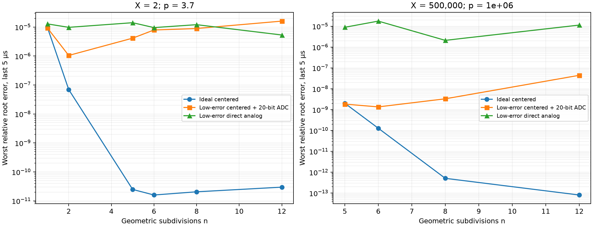
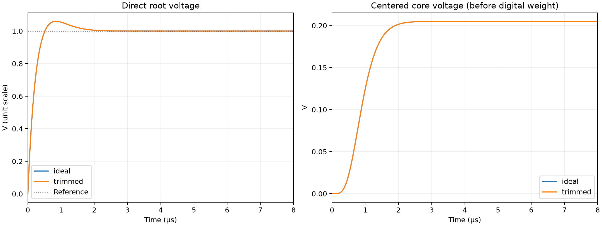

# Subdivision géométrique et lecture Padé : preuve et prototype SPICE

**Résultat : les bornes exactes sont prouvées en Lean ; le prototype mixte fonctionne sur les cas testés, mais aucun avantage de vitesse ou d’énergie sur un calcul numérique n’est démontré.**

Étude : 517 simulations SPICE (252 cas structurés, 60 essais de profondeur, 128 cas aléatoires, 5 résolutions et 72 comparaisons à précision idéale fixée), 424 vérifications indépendantes à 100 chiffres. Les simulations aléatoires utilisent 64 couples non entiers reproductibles. Ce n’est pas une preuve électrique sur le continuum des réels.

## Garanties Lean

Le module `LeanMath/Papers/GeometricSubdivision.lean` est compilé avec Lean 4.33.1 et Mathlib v4.33.1. L’audit `validation/geometric_subdivision/Audit.lean` ne trouve que `propext`, `Classical.choice` et `Quot.sound` : aucun `sorryAx` ni axiome ajouté.

- `midpoint_length` : la moyenne proportionnelle donne le milieu des exposants.
- `interval_spec` : la subdivision conserve θ dans l’intervalle et sa largeur vaut exactement 2⁻ⁿ.
- `constructed_root_bracket` : pour tous réels X ≥ 1, p ≥ 1 et tout entier n, les deux lectures Padé encadrent X^(1/p).
- `pade_width` et `pade_width_bound` : identité exacte de largeur et borne uniforme z⁵/256.
- `gap_independent_of_exponent` : le rapport des rails à profondeur fixée dépend de X et n, pas de p.
- `centered_increment` : identité de la lecture électrique centrée, sans soustraction de deux nombres proches.
- `contact_order_five` : identité polynomiale de contact avec le développement de degré 4.

Les preuves portent sur les longueurs et l’arithmétique réelles idéales. Les incidences euclidiennes trait par trait, les arrondis binaires, les transistors, la stabilité électrique et l’ordre d’une itération AK/AD ne sont pas formalisés. La borne explicite de largeur est plus informative qu’un simple O(z⁵) ; aucun théorème asymptotique séparé n’est revendiqué.

Avec Pₜ = 12 + 6(2+t)z + (t+1)(t+2)z², Qₜ = P₋ₜ, Rₜ = Pₜ/Qₜ :

`L₅ = A Rλ(z)` ; `U₅ = B / R(1−λ)(z)` ; `z = B/A − 1`.

`U₅/L₅ − 1 = λ(1−λ)(2−λ)(1+λ) z⁵ / (Pλ P(1−λ)) ≤ z⁵/256`.

## Circuit effectivement simulé

Le contrôleur numérique fournit p et X en binary64, le poids λ et les décisions de subdivision. Il décompose X par `frexp` et transporte des facteurs d’échelle en puissances de deux. Il ne calcule ni logarithme, ni exponentielle, ni racine cible. Pour comparer, le programme de référence utilise mpmath à 100 chiffres.

Chaque moyenne possède un condensateur de 20 pF, une transconductance nominale de 100 µS, un courant limité à ±1 mA et une fuite parallèle. Le courant est proportionnel à `2^parité·A·B − M²` : la moyenne apparaît comme équilibre positif du circuit. L’état initial M=1 choisit la branche positive. Les diviseurs utilisent aussi une boucle transconductance/condensateur. Les sommes et produits de la lecture sont des sources comportementales avec résistance de sortie 10 kΩ et capacité de 20 pF.

**C’est une simulation de macromodèles analogiques**, pas une netlist CMOS issue d’un PDK. Les multiplicateurs, les références, les comparateurs de programmation et les convertisseurs ne sont pas réalisés transistor par transistor. Les capacités et transconductances sont des hypothèses d’étude, pas des mesures de silicium. Les niveaux transitoires, la dynamique, la fuite, les offsets, les gains et un parasite périodique sont simulés ; le bruit thermique, les coins de fabrication, la température, la diaphonie et les saturations de toutes les cellules ne le sont pas.

La netlist déroule n cellules en cascade. Elle ne simule pas une cellule réutilisée n fois avec sample-and-hold. Le nombre de demi-cercles peut rester indépendant de p à X et tolérance fixés ; le matériel dépend aussi de la résolution et de la plage de p.

Deux sorties sont comparées : (1) moyenne des bornes électriques, convertie ou non ; (2) lecture centrée `A·(1+λ·c)`, avec `c = 6z(2+z)/Qλ` pour Padé 5. La seconde numérise A et c séparément puis recombine λ et les facteurs binaires numériquement. Le rail unité reste un registre exact. Son résultat n’est donc pas la précision d’une tension unique purement analogique. Pour l’ordre 2 cette lecture est la borne arithmétique ; pour 3 et 5 c’est la lecture Padé inférieure.

## Hypothèses de défauts

| Profil | Écart-type gain | Écart-type offset | Fuite | DAC / ADC |
|---|---:|---:|---:|---:|
| ideal | 0 | 0 | 10¹⁵ Ω | idéaux |
| trimmed (hypothétique) | 10 ppm | 2 µV équivalents | 10¹⁰ Ω | 20 bits |
| untrimmed (hypothétique) | 0,1 % | 200 µV équivalents | 10⁸ Ω | 16 bits |

Les offsets sont appliqués aux équations normalisées des cellules ; leur conversion en tension d’entrée dépend du bloc. « trimmed » désigne une cible résiduelle supposée : aucune procédure de calibration réelle n’est simulée. Un parasite sinusoïdal déterministe à 1 MHz est ajouté aux moyennes : ce n’est pas un modèle de bruit thermique. Les profils non idéaux de la grille principale ont trois tirages fixes ; cela ne suffit pas à estimer un rendement de fabrication.

## Cas demandé : p = 1 000 000, X = 500 000

Référence : `1.00001312244947599123835193485438920462356226`.

Erreurs maximales sur les 5 dernières µs, profil à faibles erreurs (`trimmed`, graine 271828), Padé 5 :

| n | Sortie directe : erreur relative racine | Lecture centrée + ADC : erreur relative racine | Erreur relative sur racine − 1 |
|---:|---:|---:|---:|
| 5 | 8.919e-06 | 1.844e-09 | 1.405e-04 |
| 6 | 1.761e-05 | 1.356e-09 | 1.033e-04 |
| 8 | 2.103e-06 | 3.309e-09 | 2.522e-04 |
| 12 | 1.137e-05 | 4.432e-08 | 3.378e-03 |



La lecture centrée bénéficie de la petite pondération à grand p. En revanche, une profondeur accrue rend z plus petit et la soustraction électrique B/A−1 plus sensible aux offsets. Le meilleur n dépend du budget de défauts : il ne suffit pas d’augmenter l’ordre ou la profondeur. Le passage de 5 à 6 subdivisions n’est ici qu’un résultat de ce tirage, pas une règle universelle.



## Portée de la campagne

Les cas structurés incluent p=1, p=1,000001, p≈√2, p=3,7, p=37,5, p=10⁶, p=10⁶+0,125 et p=10⁹ ; X va de 1,000001 à 10¹². Les 64 couples indépendants sont distribués logarithmiquement sur 1≤p≤10⁹ et 1≤X≤10¹². √2 et les autres réels entrent par une représentation binary64, pas avec une précision infinie. Le domaine prouvé reste p≥1, X≥1 ; p<1 et X<1 ne sont pas implémentés dans cette étude.

| Profil, grille + stress | Essais | Sortie directe ≤1 ppm | Lecture centrée ≤1 ppm | Lecture centrée ≤1 ppb | Encadrement électrique observé sur toute la fenêtre |
|---|---:|---:|---:|---:|---:|
| ideal | 100 | 69 | 59 | 29 | 93 |
| trimmed | 172 | 9 | 72 | 28 | 84 |
| untrimmed | 108 | 0 | 27 | 9 | 32 |

Comparaison à la même largeur relative idéale cible (10⁻⁶), pour X=500 000 et p=10⁶. La profondeur est choisie par une majoration a priori en arithmétique rationnelle, sans oracle de racine :

| Lecture | n | Blocs (diagnostic inclus) | Erreur centrée idéale | Erreur centrée à faibles défauts |
|---|---:|---:|---:|---:|
| 2 | 14 | 24 | 5.170e-09 | 1.849e-07 |
| 3 | 10 | 22 | 1.796e-10 | 1.698e-08 |
| 5 | 7 | 20 | 8.045e-12 | 2.821e-09 |

Padé peut réduire le nombre de cellules de moyenne tout en ajoutant des opérations à la lecture finale. Le coût global doit compter les deux. Les 72 essais à cible fixée sont conservés dans `accuracy/summary.json` ; leur garantie de précision idéale ne s’étend pas aux défauts électriques.

Ces comptes mélangent les ordres 2, 3 et 5 de la grille principale ; le stress indépendant utilise Padé 5. Ils décrivent uniquement les essais effectués. Les bornes électriques peuvent s’inverser ou manquer la racine : l’identité prouvée en Lean ne couvre pas les défauts du circuit. Le fichier `statistics.json` et les rapports JSON conservent les résultats défavorables.

## Temps, coût et énergie

Le temps de stabilisation est mesuré à 1 ppm de la valeur électrique finale, sans inclure programmation, acquisition, conversion et recombinaison numérique. Ce seuil peut être peu exigeant pour la petite correction à grand p ; il ne certifie pas sa précision. Les erreurs du tableau sont prises après 25 µs, sur une fenêtre de 5 µs.

| p ; X | n | Calcul numérique complet Python, médiane |
|---|---:|---:|
| 3.7 ; 2 | 5 | 1.168 µs |
| 3.7 ; 2 | 8 | 1.477 µs |
| 3.7 ; 2 | 12 | 1.827 µs |
| 1e+06 ; 500000 | 5 | 1.298 µs |
| 1e+06 ; 500000 | 8 | 1.559 µs |
| 1e+06 ; 500000 | 12 | 1.920 µs |

À n=6, le modèle contient 19 blocs comportementaux actifs (y compris les sorties de diagnostic) et se stabilise en environ 4.31 µs selon ce critère. Les blocs n’ont pas des coûts transistor équivalents.

Le calcul numérique de comparaison effectue lui aussi les n moyennes puis les deux lectures Padé, sans oracle de racine. Cette comparaison locale ne démontre aucun gain de vitesse analogique, même avant d’ajouter les conversions. Elle n’est pas une comparaison à un ASIC numérique optimisé.

Le champ `assumed_bias_energy_J` est seulement `nombre de blocs × 10 µA × 3,3 V × temps de stabilisation`. Les sources dépendantes idéales ne comptabilisent pas leur alimentation : ce champ n’est pas une énergie de puce mesurée et ne permet aucune conclusion de supériorité énergétique. Une étude de puce exige un PDK, des cellules de multiplication/division, des références et ADC/DAC réels, leur calibration et des simulations de coins/température/bruit.

## Reproduction

À la racine du dépôt, avec Lean/Lake, ngspice 46 et les bibliothèques de `requirements.txt` :

```sh
lake build LeanMath.Papers.GeometricSubdivision
lake env lean validation/geometric_subdivision/Audit.lean
python research/geometric_subdivision/spice.py
python research/geometric_subdivision/validate.py
python research/geometric_subdivision/stress.py
python research/geometric_subdivision/accuracy_campaign.py
python research/geometric_subdivision/report.py
python research/geometric_subdivision/check_results.py
```

Un essai court : `python research/geometric_subdivision/spice.py --quick`. Les deux netlists et traces représentatives sont dans `examples/`. Les traces intégrales restent locales et sont régénérables ; les JSON complets, les scripts et les figures sont conservés.
