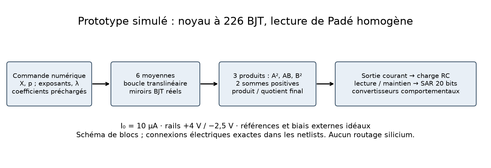
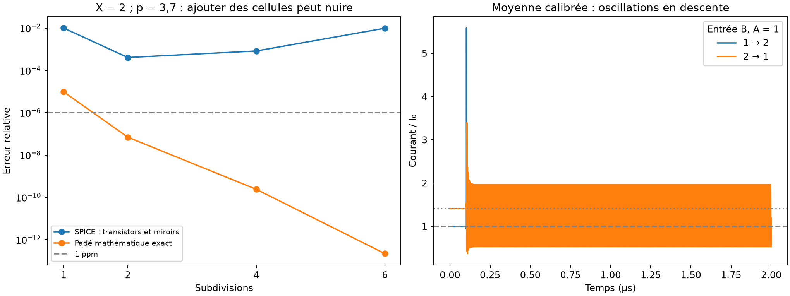

# Subdivision géométrique : prototype transistor et comparaison

**La réalisation testée ne remplace pas V30.** La lecture de Padé est exacte à l'ordre annoncé, mais sa traduction en cellules translinéaires et miroirs BJT accumule des erreurs, et certains transitoires oscillent. Ce dossier fournit une simulation électrique du noyau, une interface mixte simulée et les résultats négatifs nécessaires pour décider de la suite. Il ne fournit pas une puce prête à fabriquer.



## Ce qui a été construit et vérifié

- Un générateur de netlists avec de vrais modèles SPICE de jonctions BJT et de miroirs : **226 transistors** pour six subdivisions et la lecture complète, **286** avec correction des moyennes. Aucun `sqrt`, `pow`, logarithme ou générateur comportemental de résultat dans le noyau T2. Les sources de courant d'entrée et de polarisation restent idéales.
- Une lecture homogène de Padé à coefficients positifs : trois produits, deux sommes pondérées et une boucle produit/quotient. Elle évite de former analogiquement `B/A − 1`.
- Une calibration électrique de la moyenne, calculée sur cinq références connues, programmée dans les miroirs, puis gelée. Quatre couples de courants distincts servent à la validation de cellule. Les cibles de racine ne sont jamais utilisées pour ajuster les trims.
- **118 essais de noyau** : domaine réel échantillonné, profondeur, calibration, température −20/25/85 °C, alimentation ±5 %, dix perturbations indépendantes d'aires à σ=0,1 %, charges 1/10/100 pF, fronts montants/descendants, démarrage et pas temporel divisé par quatre. Le mismatch est une hypothèse synthétique, pas un modèle statistique de fonderie.
- Quatre analyses de bruit petit signal ; une interface DAC filtré, maintien SPICE et conversion SAR 20 bits chronométrée ; deux essais supplémentaires d'alimentation progressive.
- Huit paires communes rejouées avec **V30 et P6**, 32 essais avec primitives comportementales communes, et 12 contrôles transistor issus de P5/P6.
- Trois nouveaux théorèmes Lean pour les polynômes homogènes et leurs poids positifs, en complément de l'encadrement de racine déjà démontré. Compilation réussie ; uniquement les axiomes standards, sans `sorry`. [Audit](results/lean-axioms.log).

Le [protocole initial](PROTOCOL.md), les [mesures détaillées](MEASUREMENTS.md) et les scripts sont conservés. Le protocole distingue une comparaison de macromodèles, une comparaison de primitives et des diagnostics transistor ; aucun de ces essais ne mesure un circuit fabriqué.

## Résultat déterminant : p = 1 000 000, X = 500 000

| Quantité | Résultat |
|---|---:|
| Racine de référence, calcul indépendant 80 chiffres | 1,000013122449475991238… |
| Sortie BJT, n=6, 25 °C, non calibrée | 0,9915647973355592 |
| Erreur relative de racine | **0,844821 %** |
| Erreur rapportée au petit excès `racine − 1` | **643,807 fois cet excès** |
| Somme des puissances fournies par les rails de tension explicites | 5,76048 mW |
| Énergie de ces rails sur la fenêtre simulée de 2 µs | 11,5210 nJ |
| Temps d'établissement à 100 / 10 / 1 ppm de la vraie racine | **Non atteint** |

Ces 2 µs sont une durée d'observation démarrant à un point de fonctionnement DC, pas une latence de calcul validée. Les puissances des références idéales, générateurs de biais, convertisseurs et contrôleur ne sont pas entièrement modélisées : les 11,52 nJ ne sont donc **pas une énergie par résultat correct ni l'énergie totale d'une puce**.

Sur les 18 couples nominaux de la nouvelle chaîne à n=6, l'erreur brute va de **0,3141 % à 1,5337 %** ; aucun ne passe 100 ppm. La correction des moyennes ne résout pas ce problème : les erreurs de la lecture finale, les charges et les copies de courant restent présentes.

## L'ordre mathématique ne compense pas les erreurs électriques



Pour X=2 et p=3,7, deux subdivisions donnent environ **405 ppm** avec 146 BJT ; six subdivisions donnent **9856 ppm** avec 226 BJT. L'approximation mathématique, elle, s'améliore. Ajouter des cellules n'est donc pas une amélioration électrique monotone. Le meilleur point du balayage ne constitue pas une politique validée sur tout le domaine.

La calibration affine de cellule est construite avec `A=u²`, `B=v²`, donc une cible connue `u·v`. Le fit générique donne gain 0,9968209824 et offset −0,0011628057 (en unités I₀). Sur les quatre couples distincts, l'erreur maximale passe de 4709 à 4553 ppm : amélioration limitée. Les copies supplémentaires de la correction ont leurs propres erreurs ; la calibration n'est pas une soustraction parfaite appliquée au résultat de validation.

Les fronts descendants de la moyenne corrigée montrent des oscillations dans les fenêtres enregistrées. Quatre essais de démarrage à conditions initiales nulles et deux avec rampes d'alimentation n'ont pas terminé dans le délai de solveur de 45 s. Ce sont des **échecs de simulation à investiguer**, pas une preuve qu'aucun démarrage physique n'est possible. Les mesures issues d'un point DC ne suffisent pas à valider la stabilité. Le contrôle de pas 1 ns / 0,25 ns reproduit la sortie du cas montant non calibré à environ 6×10⁻¹¹ près ; il ne valide pas tous les transitoires.

## Comparaison aux pistes antérieures

| Piste | Ce qu'établissent les dossiers et nouveaux contrôles | Conclusion actuelle |
|---|---|---|
| [P0](../pandrosion_analog/README.md), [P1](../pandrosion_analog_p1/README.md) | Premiers macromodèles ; P1 cubique sous 0,1 % dans ses scénarios | Points de départ, pas puces transistor |
| [P2](../pandrosion_analog_p2/README.md) | Calibration électrique ; 10,96 ppm sur quatre entrées cubiques inédites, lecture à 645 µs | Plus précis dans ce domaine restreint et ce modèle |
| [P3](../pandrosion_analog_p3/README.md), [P4](../pandrosion_analog_p4/README.md) | Commande du dénominateur puis correction des charges mémoire ; P4 AD 11,13 ppm nominal, 43,85 ppm dans ses variations | Leur traitement des ports reste indispensable |
| [P5, source conservée](vendor/previous/README_p5.md) | Noyau cubique à 55 BJT. Trois contrôles ici, mêmes modèles génériques et I₀=10 µA : 44 à 377 ppm bruts | Meilleure base transistor cubique que la nouvelle cascade dans ces contrôles ; domaine et terminaisons diffèrent |
| [V30](../analog_fast_ad/SPEED_ACCURACY.md) | Nouvelle comparaison : **8/8 sous 1 ppm**, pire 0,3543 ppm, politique 4,785 ms | Référence de précision la plus convaincante parmi les contrôles exécutés ici |
| [P6, source conservée](vendor/previous/README_p6.md) | Nouvelle comparaison : **6/8 sous 1 ppm** à 180 µs / 16 lectures, pire 1,333 ppm ; ses campagnes historiques avaient d'autres cas et réglages. Contrôles BJT ici : 617 à 5508 ppm | Piste rapide au niveau macromodèle, pas supériorité transistor démontrée |
| Correction AD en contre-réaction, branche historique `research/analog-ad-feedback` | 24 % de gain isolé ; 60/64 à 1 ppm contre 64/64 pour V30 dans son étude | Gain local insuffisant pour remplacer V30 |
| Mémoire 33 nF de cette même branche | 5,035 ms contre 9,585 ms dans son contrôle à pilotes finis ; échec nominal additionnel à 1,287 ppm | Candidat de vitesse avec fragilité résiduelle |
| Nouvelle subdivision + Padé | p réel conservé dans les équations ; noyau physique simulé mais précision et démarrage insuffisants | **Pas meilleure globalement à ce stade** |

Les chiffres P0–P4 et des deux pistes de la branche historique sont des résultats archivés, pas des simulations transistor rejouées dans cette campagne. Les sources historiques et empreintes sont indiquées dans [PROVENANCE.md](PROVENANCE.md). La [table commune](MEASUREMENTS.md) donne chaque paire plutôt qu'un classement global artificiel. Aucun des dossiers examinés n'établit une supériorité universelle ou un rendement de fabrication.

La comparaison de primitives impose les mêmes pertes par ports, coefficients 24 bits, conversion 24 bits, fronts et lois de cellule. Elle exclut les mémoires de V30 et compare la nouvelle chaîne à P6. Même le profil nommé `ideal` conserve les pertes de charge : il désigne l'absence de gain/offset ajoutés, pas une arithmétique exacte. Ce contrôle isole certains effets de l'architecture, sans égaliser énergie ou aire.

## Essai de modèles de fonderie et bruit

Un sous-ensemble des [modèles SkyWater SKY130](https://github.com/google/skywater-pdk-libs-sky130_fd_pr/tree/f62031a1be9aefe902d6d54cddd6f59b57627436) est figé, avec licence Apache-2.0 et empreintes. L'adaptateur conserve les équations sources, impose les multiplicateurs nominaux documentés et utilise une aire BJT continue pour représenter les ratios des miroirs. Les connexions de substrat et ce redimensionnement sont des choix de recherche, pas des cellules de layout qualifiées. Le PNP reste nominal ; les fichiers de coins NPN seuls ne constituent pas des coins complets de procédé.

**Cette tentative ne valide pas SKY130 pour notre puce.** ngspice ignore certains paramètres (`dcap`, plusieurs paramètres thermiques, entre autres), les biais n'ont pas été qualifiés contre toutes les limites électriques du procédé, et le circuit n'a ni layout ni extraction parasitique. Les températures de l'adaptateur sont donc exploratoires. La moyenne nominale y est déjà très imprécise. Aucun résultat de cet adaptateur n'est présenté comme une prédiction de silicium ou une vérification de fabrication.

Les analyses `.noise` couvrent 1 Hz–1 GHz autour du point DC. Le modèle générique donne 337 µV RMS sur la charge de la moyenne et 71 mV sur celle de la chaîne ; ces valeurs diagnostiques dépendent fortement de la bande et du point de fonctionnement. Pour une chaîne présentant des problèmes dynamiques, elles ne valident pas un fonctionnement faible bruit. Le bruit des références et des convertisseurs n'est pas inclus, et le bruit petit signal n'a pas été superposé aux transitoires non linéaires.

## Interface complète simulée : limites précises

Le [banc d'interface](interface.py) ajoute un DAC de courant comportemental 20 bits avec filtre 100 Ω / 1 nF, un amplificateur de lecture imparfait, un commutateur SPICE 120 Ω, un maintien 10 pF, une injection de 1 fC et vingt décisions SAR espacées de 20 ns. La lecture est fixée avant les essais, sans rechercher un instant favorable : fin de conversion à 2,501 µs, soit 2,401 µs après le début du front d'entrée. La tension du maintien est relue à chaque décision SAR.

Les trois essais échouent à la cible de précision, dont environ **0,833 %** pour p=1 000 000, X=500 000. Cette durée est celle du protocole de conversion, **pas le temps d'obtention d'un résultat correct**. Les coefficients sont préchargés ; leur programmation, le contrôleur et les convertisseurs CMOS transistor ne sont pas réalisés. Une simulation avec interface ne signifie donc pas une puce numérique-entrée/numérique-sortie entièrement conçue au niveau transistor.

## Décision technique et travail encore nécessaire

La formalisation et l'exploration électrique sont réalisées ; la qualification d'une puce reste bloquée par les résultats. Il serait prématuré de dessiner le layout de cette cascade ou de la présenter comme plus rapide/économe que V30.

1. Corriger d'abord la stabilité et le démarrage **d'une seule moyenne** avec miroirs et charge, puis vérifier ses transitions dans les deux sens. Réduire la profondeur ne supprime pas cette exigence.
2. Concevoir une lecture différentielle/centrée et un étalonnage **de chaque famille de copie, produit et quotient**, dans ses conditions de charge. La calibration de moyenne seule testée ici échoue ; aucune précision résiduelle hypothétique ne doit être rebaptisée calibration obtenue.
3. Refaire la comparaison avec un modèle procédé effectivement compatible, limites électriques vérifiées, tailles réalisables, parasites et mismatch qualifiés. L'adaptateur présent n'est pas suffisant.
4. Après franchissement de ces étapes, intégrer contrôleur, références, DAC/ADC physiques, puis comparer énergie **par résultat correct** à précision et domaine identiques. P5 est un témoin utile pour la cellule cubique ; V30/P6 sont les témoins fonctionnels pour les grands degrés.

## Reproduire

Python 3 avec numpy, mpmath et matplotlib ; ngspice 46 utilisé pour les mesures conservées. Depuis la racine du dépôt :

```sh
python research/geometric_subdivision_chip/campaign.py
python research/geometric_subdivision_chip/compare.py
python research/geometric_subdivision_chip/matched.py
python research/geometric_subdivision_chip/electrical.py
python research/geometric_subdivision_chip/interface.py
python research/geometric_subdivision_chip/ramped.py
python research/geometric_subdivision_chip/check.py
python research/geometric_subdivision_chip/report.py
lake build LeanMath.Papers.GeometricSubdivision
lake env lean research/geometric_subdivision_chip/audit.lean
```

Les traces volumineuses sont régénérables dans `results/*_raw` et `results/raw`, ignorées par Git. Des netlists, journaux et traces représentatives sont conservés dans `examples/`. Les essais sous délai conservent une erreur dans le JSON ; une erreur ou oscillation ne compte jamais comme un succès à 1 ppm. Le contrôle automatisé vérifie l'algèbre, la séparation calibration/validation, l'absence d'oracle de racine et la reproduction de deux mesures ; il n'affirme pas que la puce atteint sa cible.
