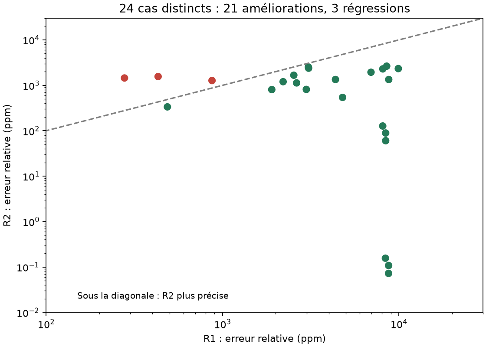

# Révision R2 : moins d'erreur nominale, robustesse encore insuffisante

La révision améliore **21 des 24 cas distincts testés** après gel de la procédure de calibration. Elle conserve six subdivisions et 226 BJT, ajoute 45 capacités de compensation de 10 pF, calibre quatre familles de miroirs et corrige la moyenne dans sa boucle de retour. Les trois régressions et les échecs de démarrage restent enregistrés. Les résultats concernent des modèles BJT génériques ; ils ne qualifient pas une puce fabriquée.

## Résultats principaux

| Cas / chaîne de mesure | Ancienne version | R2 |
|---|---:|---:|
| p=1 000 000, X=500 000 : cœur, pire erreur dans la fenêtre finale | 8448,21 ppm | **0,17754 ppm** |
| Même cas : ADC 20 bits, même calibration du convertisseur pour R1 et R2 | 8447,22 ppm | **2,1362 ppm** |
| Même cas : ADC 24 bits calibré, même conversion pour R1 et R2 | 8448,37 ppm | **0,03813 ppm** |
| p=3,7, X=2 : cœur, pire erreur finale | 9855,88 ppm | **1919,04 ppm** |

Ces chiffres mesurent le **biais déterministe**, sans bruit superposé au transitoire. Pour le cas à un million, l’erreur rapportée au petit excès `racine − 1` est encore de 1,35 % au cœur et environ 16,3 % après le SAR 20 bits.

Les 0,038 ppm du cas 24 bits comprennent une compensation partielle fortuite des erreurs du cœur et du convertisseur : ce résultat ponctuel **ne constitue pas une précision garantie de 24 bits**. Le résultat 20 bits est plus représentatif de la limite de conversion de ce banc. Sans étalonnage du convertisseur, R2 est à 124,2 ppm dans le cas à un million.

Les puissances des rails explicites, dans le cas à un million, passent de 5,7605 à 5,7867 mW. Les références, le contrôleur, les convertisseurs et le coût de calibration ne sont pas entièrement représentés : aucune amélioration d'énergie par résultat correct n'est revendiquée.



[Table de tous les cas](MEASUREMENTS.md) · [Mesures et calibrations](results.json) · [Comparaison ADC](adc-calibrated.json)

## Modifications électriques

1. **Miroirs calibrés séparément.** Les gains des quatre familles NPN/PNP, avec ou sans cascode, sont mesurés avec un courant de référence. Les rapports d'aire sont précompensés ; les modèles de transistors et leurs imperfections restent actifs.
2. **Correction dans la boucle de moyenne.** Trois mesures à A=B=1 ajustent le rapport de retour selon `f_nouveau = f × mesure²`. Cela évite l'étage affine ajouté après chaque moyenne dans le précédent essai de calibration. Le réglage nominal obtenu est 1,0201677716.
3. **Compensation dynamique.** Une capacité base-émetteur de 10 pF est ajoutée à chacun des 45 transistors d'assistance concernés. Dans le test descendant de moyenne isolée, l'oscillation de fenêtre finale passe d'environ 1,05 unité à 1,30×10⁻⁷ unité. Cela ne prouve pas la stabilité de toute la cascade.
4. **Calibration de lecture adaptée au domaine.** Pour p≥64 et n=6, le rail A est l'unité exacte. On programme temporairement λ=0 : les polynômes P et Q sont identiques, et la cible de sortie est connue, égale à 1, quels que soient les courants du rail B. La calibration conserve les charges et le courant d'entrée du travail visé. Trois mesures règlent le miroir de sortie ; puis on rétablit λ. Pour p<64, la référence de lecture utilise A=B=1 ; elle corrige moins bien les variations de charge.
5. **Calibration du convertisseur.** Cinq tensions indépendantes, 0,7 / 0,85 / 1 / 1,15 / 1,3 V, traversent l'amplificateur, le maintien et le SAR simulés. Un gain et un offset sont ajustés sur leurs codes, puis gelés. La correction des codes est numérique, comme dans le modèle de convertisseur V30.

La calibration n'utilise aucune racine cible. Elle utilise des identités de référence et des courants/tensions connus. L'identité `R(0,z)=1` a été ajoutée à Lean et compilée ; l'[audit d'axiomes](lean-axioms.log) ne contient que les axiomes standards. Les sources du noyau T2 ne contiennent aucun générateur comportemental de racine, de produit ou de quotient.

## Procédure gelée et validation

Les quatre couples de développement sont p=3,7/X=2, p=1 000 000/X=500 000, p=3/X=2 et p=37,5/X=500 000. La procédure de référence est ensuite appliquée sans adaptation aux résultats de racine à 24 couples : p∈{1,2 ; √2 ; 2,7 ; 7,3 ; 22,25 ; 64,1 ; 1200,5 ; 999999,75}, X∈{1,3 ; 17 ; 120000}.

**La procédure est gelée, mais un réglage de sortie est mesuré par configuration.** Pour les grands degrés, la référence λ=0 conserve même l'entrée X du travail. Ce n'est donc pas un jeu unique de trims utilisable sans réétalonnage pour toutes les entrées. Les états de calibration sont simulés séparément ; les commutateurs de calibration, le séquencement complet et leur coût ne sont pas réalisés au niveau transistor. Les références et rapports d'aire programmables restent des hypothèses de banc.

Trois couples régressent : p=2,7/X=1,3 ; p=2,7/X=17 ; p=22,25/X=17. Par exemple, p=2,7/X=17 passe de 278 à 1448 ppm. Aucun sélecteur R1/R2 n'a été choisi après observation de ces cas pour masquer ces échecs.

Une [sensibilité fixe à 16/20/24 bits des trims](trim-resolution.json) est conservée séparément. Le test principal utilise des rapports d'aire continus, écrits avec la précision du générateur SPICE ; des réglages matériels de cette finesse ne sont pas acquis.

## Limites importantes

- Les valeurs nominales partent d'un point de fonctionnement DC. Le démarrage du cœur depuis zéro ou avec rampe reste en échec dans le banc ; l'absence d'oscillation de la cellule isolée ne résout pas ce problème.
- Les [16 tests de perturbation](stress.json) réutilisent les trims nominaux sans réétalonnage : température −20/85 °C, alimentation ±5 %, mismatch synthétique σ=0,1 %, charge 100 pF et démarrage. Les erreurs peuvent redevenir très grandes. Dans le cas à un million, ±5 % d'alimentation suffit à produire environ 2558 ppm.
- Les [huit analyses de bruit petit signal](noise.json) montrent une forte réduction des pics intégrés jusqu’à 1 GHz, mais **pas de réduction utile dans la bande 1 Hz–1 MHz**. Pour le cas à un million, R2 donne 9,61 µV RMS sur une sortie d’environ 10 mV, soit environ **961 ppm RMS**. Ce bruit dépasse largement le biais corrigé de 0,18 ppm. Le bruit des références et du convertisseur n’est pas ajouté ; la résolution effective au niveau ppm n’est donc pas démontrée. Les très grands résultats petit signal de R1 à 1 GHz ne constituent pas une prédiction linéaire fiable de son régime non linéaire.
- Le DAC, l'amplificateur de lecture et le SAR restent comportementaux. À 20 bits, fin de conversion à 2,501 µs ; à 24 bits, 2,581 µs. Ces durées excluent la calibration, la programmation et un démarrage qualifié. Elles ne permettent pas de déclarer R2 plus rapide que V30.
- R2 n'est pas validée avec un PDK. Elle n'est pas encore un remplacement général de V30, même si son cœur nominal est nettement plus précis sur les grands degrés testés.

La prochaine priorité est de rendre le démarrage reproductible et la calibration stable avec la température et les charges. La lecture en référence λ=0 fournit une piste utile pour une future procédure d'auto-zéro réellement commutée.

## Reproduction

Depuis la racine du dépôt, avec les mêmes dépendances que le dossier parent :

```sh
python research/geometric_subdivision_chip/improve.py
python research/geometric_subdivision_chip/improve_interface.py
python research/geometric_subdivision_chip/improve_adc.py
python research/geometric_subdivision_chip/improve_noise.py
python research/geometric_subdivision_chip/check_improvement.py
python research/geometric_subdivision_chip/report_improvement.py
lake build LeanMath.Papers.GeometricSubdivision
lake env lean research/geometric_subdivision_chip/audit.lean
```

Les essais de démarrage peuvent atteindre le délai de solveur de 45 s. [checks.json](checks.json) vérifie les références utilisées, la restitution des trims, l'absence d'oracle et la reproduction du cas nominal à un million. Il ne transforme pas les régressions ni les échecs de démarrage en succès.
