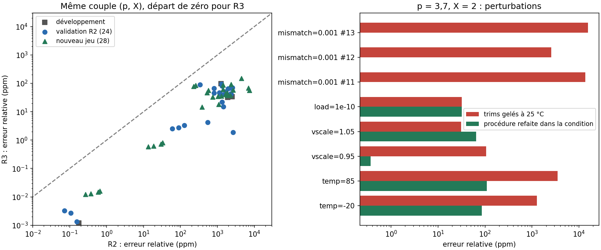

# Révision R3 : primitives électriques refaites, démarrage et température maîtrisés

R3 garde l'algorithme (six moyennes géométriques, lecture homogène de Padé, p réel) et refait les **primitives transistor**. Sur les 56 couples (p, X) mesurés — 4 de développement, les 24 de validation R2 et **28 nouveaux couples jamais simulés avant le gel de la procédure** — R3 est plus précise que R2 dans **56 cas sur 56**. Les résultats restent ceux d'un modèle BJT générique en simulation : ni PDK qualifié, ni layout, ni mesure de silicium.



## Résultats principaux

Erreur relative maximale sur les 4 dernières µs d'une simulation de 20 µs **démarrant de zéro** (rails et sources allumés à t = 0, toutes tensions nulles). R2 : même critère, depuis un point DC.

| Couples | R2 | R3 |
|---|---:|---:|
| p = 3,7, X = 2 (développement) | 1 919 ppm | **31,9 ppm** |
| p = 1 000 000, X = 500 000 (développement) | 0,18 ppm | **0,001 ppm** |
| 24 couples de validation R2, pire cas | 2 642 ppm | **94 ppm** |
| 28 nouveaux couples, pire cas (R2 rejouée à l'identique) | 7 360 ppm | **150 ppm** |
| p < 64, tous les couples (34) | 229 – 7 360 ppm | **1,9 – 150 ppm** |
| p = 64,1 et 90,2 (7 couples) | 750 – 2 383 ppm | **33 – 66 ppm** |
| p = 1 200,5 et 5 000,5 | 13 – 127 ppm | **0,59 – 3,3 ppm** |
| p ≥ 250 000 | 0,07 – 0,66 ppm | **0,001 – 0,016 ppm** |

Autres mesures :
- **Taille.** 349 BJT pour n = 6, contre 226 en R2, plus 45 diodes de clamp et 52 condensateurs, dont 45 × 10 pF de compensation.
- **Puissance.** Les rails explicites fournissent 6,9 à 7,6 mW, contre 5,8 mW en R2. Ce chiffre comprend toutes les sources idéales de polarisation, de fuite et de trim reliées aux rails, mais pas le contrôleur ni les convertisseurs.
- **Démarrage.** La sortie atteint 1 ppm de sa valeur finale en 6,6 à 14,3 µs selon le cas et la condition.
- **Échelon d'entrée.** Après un échelon de X (même exposant binaire, dans les deux sens), la sortie revient à 100 ppm de la nouvelle racine en 0,12 à 0,48 µs. Pour p = 10⁶, elle atteint 1 ppm en 0,40 à 0,69 µs. Un pas temporel 4 fois plus fin donne les mêmes erreurs à 10⁻⁹ près en relatif.

Quatre des 24 couples R2 (1,2/1,3 ; 2,7/17 ; 7,3/120 000 ; 1 200,5/17) ont servi de diagnostic pendant la conception ; ils sont marqués dans [MEASUREMENTS.md](MEASUREMENTS.md). Le nouveau jeu de 28 couples est le test aveugle : il a été simulé une seule fois, après le gel de la procédure, dont l'empreinte est écrite avant tout score.

## Ce qui n'allait pas dans R2, et pourquoi

Les diagnostics de cette révision corrigent aussi deux conclusions de R2 :
- **« Échecs de démarrage » de R2.** Ils venaient de la fenêtre d'observation de 2 µs. La chaîne R2 démarrée de zéro se stabilise après environ 4,6 µs.
- **+257 % d'erreur à 85 °C.** La cause est une référence de clamp fixe. À 85 °C, V_be baisse de 0,13 V par jonction et les diodes de clamp injectent environ 2 I₀ dans les entrées des miroirs.

L'erreur des petits degrés (1 000 à 2 600 ppm) avait trois causes mesurées :
1. **Effet Early dans les miroirs**, environ 1 800 ppm dépendant du niveau. Les sorties étaient cascodées à une tension fixe, alors que la diode d'entrée suit le niveau du signal.
2. **Couplage β dans chaque boucle.** Le courant d'émetteur de la jonction montante u₂ s'ajoute à celui de la jonction descendante d₁.
3. **Courants de base des transistors d'assistance** : un offset de 5×10⁻⁴ I₀ côté NPN et de 2×10⁻³ I₀ côté PNP, plus −125 ppm par sortie PNP.

## Modifications électriques

1. **Polarisations par répliques.** Chaque tension de cascode ou de clamp est produite sur la puce par un empilement de jonctions alimenté par un courant I₀, tamponné par un suiveur de même polarité. Ces tensions suivent donc la température et l'alimentation. Il ne reste que deux rails de tension idéaux.
2. **Miroirs cascodés en entrée et en sortie** sur une même ligne de polarisation. La diode et les sorties voient le même V_ce à tout niveau, et les courants de base des cascodes s'annulent entre entrée et sorties. Les miroirs PNP utilisent un transistor d'assistance Darlington : l'erreur par sortie passe de −125 à −1,4 ppm.
3. **Boucles translinéaires cascodées.** Les quatre jonctions sont cascodées sur une même ligne ; le calcul montre que les paires montante/descendante voient alors des V_ce identiques. Les jonctions de boucle ont une aire ×4 pour réduire les effets de résistance d'émetteur et de forte injection. Le transistor d'assistance est simple, suivi d'une diode de décalage de niveau.
4. **Isolation des bases de cascode** par une résistance de 20 kΩ/aire. C'est la correction qui a supprimé les verrouillages au démarrage : un cascode saturé ne peut plus faire s'effondrer la ligne de polarisation commune.
5. **Trims.** Le rapport κ compense le couplage β dans chaque boucle. Des courants constants compensent les courants de base des transistors d'assistance. Les gains de miroir sont étalonnés pour chacune des trois classes de tension de destination, car l'effet Early module l'α du cascode d'environ 350 ppm entre 0 V et 2 V.

Le noyau ne contient aucune source comportementale (B, E, F, G, H). Les éléments idéaux sont les deux rails, les sondes de 0 V, les courants d'entrée DAC et les courants de polarisation, de fuite et de trim ([VALIDATION.json](VALIDATION.json)).

## Procédure d'étalonnage gelée

Elle n'utilise que des courants connus et des identités exactes, sans jamais évaluer de racine cible ([r3_calibrate.py](../r3_calibrate.py)) :
1. **Miroirs.** Deux bancs, NPN et PNP, mesurés à I₀ et 2 I₀, donnent l'offset et le gain. Le gain est ensuite mesuré à chacun des trois niveaux de destination.
2. **Cellule moyenne.** Cinq identités exactes, `moyenne(u², v²) = u·v`, fixent trois paramètres physiques par moindres carrés amortis : le rapport de retour f, κ et le trim de boucle.
3. **Sortie.** L'étalonnage reprend celui de R2 : λ = 0 pour p ≥ 64, référence A = B = 1 sinon.

Un modèle à 5 paramètres et un jeu de 7 identités ont été essayés et écartés sur la seule base des couples de développement.

## Robustesse ([stress.json](stress.json), [startup.json](startup.json), [transitions.json](transitions.json))

Les trims sont gelés à 25 °C, sauf dans la colonne « procédure refaite », où tout l'étalonnage est rejoué dans la condition, avec les seuls courants connus.

| Condition | p = 3,7 / X = 2 : gelé → refait | p = 10⁶ / X = 5×10⁵ : gelé | R2, même condition |
|---|---:|---:|---:|
| −20 °C | 1 276 → 86 ppm | 0,093 ppm | 5,2 % / 3,8 % |
| 85 °C | 3 492 → 109 ppm | 0,16 ppm | 402 % / 336 % |
| alimentation −5 % / +5 % | 106 / 31 ppm | 0,008 / 0,006 ppm | 4 482 / 8 345 ppm |
| charge 100 pF | 31,9 ppm (inchangé) | 0,001 ppm | 1 919 ppm |
| mismatch σ = 0,1 %, 3 tirages | 2 566 – 15 592 ppm | 0,0004 – 0,06 ppm | 8 452 ppm (1 tirage) |

- **Démarrage.** Départ brutal : 36/36 établis sur 4 couples, 3 températures et 3 alimentations. Rampe d'alimentation de 1 µs : 12/12. En rampe, le solveur a besoin de l'option `rshunt = 10¹² Ω`, sous 0,3 ppm d'I₀, uniquement dans ce mode.
- **Dépassement au démarrage.** Le transitoire de mise sous tension dépasse la valeur finale d'un facteur 50 à 1 260 pendant quelques µs. Ce n'est pas un défaut de calcul, mais le dimensionnement des rails doit en tenir compte.

## Limites qui restent décisives

- **Bruit.** L'analyse petit signal donne un bruit blanc d'environ 1,0×10⁻⁶ /√Hz relatif, soit environ 1 000 ppm RMS sur 1 MHz, comme R2 : c'est la grenaille à I₀ = 10 µA. Il faut moyenner environ 5 ms pour 10 ppm RMS et environ 0,5 s pour 1 ppm. Le modèle n'a pas de bruit en 1/f, donc ces temps sont optimistes. Sur la bande 1 Hz–1 GHz, le bruit monte à 7–12 % : un filtrage de sortie est indispensable ([noise.json](noise.json)). **La précision déterministe sous le ppm des grands degrés n'est donc utilisable qu'après ce moyennage.**
- **Mismatch.** L'étalonnage par famille ne corrige pas les écarts copie par copie. Aux petits degrés, un mismatch aléatoire de 0,1 % redonne des erreurs de l'ordre du pourcent, sans gain sur R2. Il faudrait un étalonnage par cellule, des composants plus gros ou un appariement dynamique.
- **Température sans réétalonnage** : 800 à 3 500 ppm aux petits degrés sur −20/85 °C. Un réétalonnage périodique est nécessaire.
- **Réglage de sortie.** Comme en R2, il est mesuré pour chaque configuration (p, X) ; le banc de convertisseurs R2 n'a pas été refait pour R3.
- **Modèles.** Modèles BJT génériques ; l'adaptateur SKY130 n'a pas été rejoué.

## Comparaison avec V30 et P6

À niveau transistor, R3 est le meilleur circuit du projet. Les contrôles P6 en BJT réels donnaient 617 à 5 508 ppm, et P5, limité à p = 3, 44 à 377 ppm. R3 couvre en plus les p réels.

Elle **ne démontre pas** une supériorité sur V30. Les résultats sous le ppm de V30 (8/8, pire 0,354 ppm, 4,785 ms) sont ceux d'un macromodèle. Et une fois le bruit compté, R3 a besoin d'un temps de moyennage du même ordre pour 10 ppm. La prochaine comparaison utile est V30 en transistors, avec le même modèle de bruit et le même temps de mesure.

## Reproduire

Depuis la racine du dépôt (Python 3, numpy, mpmath, matplotlib ; ngspice 46) :

```sh
python research/geometric_subdivision_chip/r3_campaign.py      # étalonnage gelé, validation, stress, échelons
python research/geometric_subdivision_chip/r3_startup.py
python research/geometric_subdivision_chip/r3_noise.py
python research/geometric_subdivision_chip/r3_report.py
python research/geometric_subdivision_chip/r3_check.py
```

`r3_check.py` vérifie plusieurs points :
- l'empreinte de l'étalonnage gelé ;
- l'absence d'oracle dans le code d'étalonnage ;
- le caractère exact des identités ;
- la composition des netlists.

Il rejoue aussi trois netlists avec ngspice seul et écrit [SHA256SUMS](SHA256SUMS). Les traces brutes (`r3/raw`) sont régénérables et ignorées par Git. Trois netlists complètes et leurs journaux sont conservés dans [examples](examples) ; leurs traces (plusieurs Mo) sont régénérées par `r3_check.py` et vérifiées par leurs empreintes dans [VALIDATION.json](VALIDATION.json). `R3_REUSE=1` relit une trace existante seulement si la netlist regénérée lui est identique octet pour octet.
