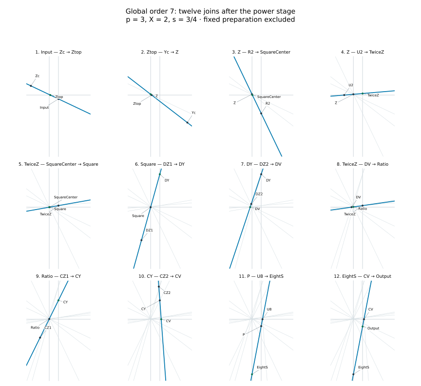

# Global order seven with a twelve-join correction

**Follow-up result, 19 September 2026.** There is an explicit finite straightedge
protocol for the classical diagonal Padé [3/3] correction: **12 joins after the
power stage, zero mobile parallels and zero circles**. Its scalar iteration
converges monotonically from every positive starting value for every p≥3.
The prepared constants are rational functions of p and X; no cubic equation
or nonconstructible coefficient is required.

This answers the comparable-cost question left open by the
[first factorization study](../geometric_factorization/report.md), within V20's
specific expanded trace convention. It does not prove an optimal trace count,
uniform floating-point conditioning, or priority for the incidence protocol.
The V20 manuscript is unchanged, and the main gallery is unchanged by this follow-up.

## Correction and rigorous global argument

Let t=Xs^p, z=(t−1)/(t+1), and

    a=(3p²−2)/(5p²),       b=(4p²−1)/(15p²),
    D(z)=p(1−a z²)/(1−b z²),
    C7(t)=(D(z)−z)/(D(z)+z),       s+=s C7(t).

This is diagonal Padé [3/3] for t^(−1/p). The representation evaluates one
homography of z² instead of factoring cubic polynomials. It is reciprocal:
C7(1/t)=1/C7(t). Define the scaled polynomials

    A=15p³−(9p³−6p)z²,
    B=15p²−(4p²−1)z²,
    N=A−zB,       Q=A+zB,       K=(p²−1)(4p²−1)(9p²−1).

Then D=A/B and C7=N/Q. A geometric factorization is κ=N, r=−2zB.
For |z|<1 and p≥3,

    B=11p²+1+(4p²−1)(1−z²)>0,
    D(z)≥D(1)=6p(p²+1)/(11p²+1)≥9/5.

The last inequality follows from

    D(1)−9/5=3(p−3)(10p²−3p+1)/(5(11p²+1))≥0.

Consequently N,Q>0, and |z/D|<5/9. There are no positive-input poles.
For logarithmic error e=log(s/X^(−1/p)), z=tanh(pe/2), put

    F(z)=2 atanh(z)/p+log(N/Q)=e+.

The following exact identity, independently checked symbolically and as a
polynomial certificate in Lean, supplies a direct global proof:

    F′(z)=2 K z⁶ / [p(1−z²)NQ].

Its denominator is positive and K>0. Hence F is strictly increasing away from
its stationary point at zero, F(0)=0, and e+ has the same sign as e. For z>0,
0<C7<1, while for z<0, C7>1. Therefore

    0 < e+/e < 1           whenever e≠0.

The iterates move toward the root without crossing it. Their only possible
limit is the root: they are monotone and bounded, the map is continuous, and
C7=1 holds only at z=0. This proves convergence from **every** positive start,
not merely on a numerically sampled basin. It is not a uniform contraction-rate bound.

At z=0, N=Q=15p³. Integrating the derivative expansion and substituting
z=tanh(pe/2) gives

    e+ = K e⁷/100800 + O(e⁹).

K>0 for p≥3, so the order is exactly seven. For p=3 the coefficient is 2/9.
The rational function has degree at most [3/3] in t and contact order seven,
identifying it with the classical Padé approximant by uniqueness.

## Prepared geometry

Normalize coordinates by (x/W,y/H); this preserves every straight-line
incidence. Work with rails L:x=0, R:x=1 and H:y=1. A point at height y
represents q=1−y. The power stage supplies E=(1,1−s^p) on R, and the current
point is P=(1,1−s). No value of the target root is supplied to the construction.

Prepare nine fixed points, all finite for p≥3,X>0:

| Name | Coordinates |
|---|---|
| Zc | (−2,1+2/X) |
| Yc | (4,−2) |
| R2 | (1,−1) |
| U2 | (−1,1) |
| DZ1 | (−1,1−10p²/(3p²−2)) |
| DZ2 | (−(4p²−1)/Δ, 1+50p²(p²−1)/((3p²−2)Δ)) |
| CZ1 | (−1,−1) |
| CZ2 | (8/9,41/9) |
| U8 | (8/7,1) |

Here Δ=18p³−4p²−12p+1. It is positive because
Δ=(p−3)(18p²+50p+138)+415. Fixed preparation costs are excluded from the
mobile counts, as in V20; preparing nine rational points is not free.
No fixed circle is used. The existing rails are reused.

## The twelve joins

Each row draws one line through two already available points and intersects
it with a fixed rail. Intersections are not extra traces under V20's convention.

| Join | Draw | Intersect | Obtained quantity |
|---:|---|---|---|
| 1 | E Zc | H at Ztop | x=2(1−t)/(2+t) |
| 2 | Ztop Yc | L at Z | q=z |
| 3 | Z R2 | H at SquareCenter | x=z/(z−2) |
| 4 | Z U2 | R at TwiceZ | q=2z |
| 5 | TwiceZ SquareCenter | L at Square | q=z² |
| 6 | Square DZ1 | R at DY | auxiliary affine coordinate |
| 7 | DY DZ2 | H at DV | x=1/(1−2D) |
| 8 | **TwiceZ reused** DV | L at Ratio | q=v=z/D |
| 9 | Ratio CZ1 | R at CY | q=2v−2 |
| 10 | CY CZ2 | H at CV | x=8(1+v)/(7+9v) |
| 11 | P U8 | L at EightS | q=8s |
| 12 | EightS CV | R at Output | q=s(1−v)/(1+v)=s C7 |

The saving from 13 to 12 comes from reusing TwiceZ in join 8. There is no
additional transfer of z and no final horizontal readout to draw.

The two-join homography used in rows 6–7 is general. To map L(u) to a top-rail
abscissa F(u)=(n1 u+n0)/(d1 u+d0), let

    α=n1/d1,
    β0=2(α d0−n0)/(d1(1−α)),
    β=β0+2d0/d1.

Join L(u) to (−1,1+β), intersect R at q=2u+β; then join to
(α,1−β0) and intersect H. The abscissa is exactly F(u). For rows 6–7 use
(n1,n0,d1,d0)=(−b,1,2pa−b,1−2p). Rows 9–10 use (8,8,9,7).
The prototype uses these incidence operations, not scalar assignment of C7
or of the final point. `verify.py` checks the underlying rational identities.

## Finite-chart validity, including the root

* Ztop.x∈(−2,1), so its join to Yc.x=4 meets L finitely.
* z∈(−1,1), hence the square-center denominator z−2 never vanishes and
  SquareCenter.x∈(−1,1/3). Its join with TwiceZ.x=1 is always proper.
* D≥9/5, so DV.x=1/(1−2D)∈[−5/13,0). The second homography's denominator
  is proportional to B−2A<0, and 2pa−b>0. Its prepared centers are proper.
* |v|<5/9 implies 7+9v>2 and 1+v>4/9. In particular
  CV.x∈(28/27,16/9), away from the right rail x=1 for each fixed p.
* s>0 makes the final source EightS distinct from the top rail. Its join to
  CV and the preceding copy from P are proper and give a finite positive readout.

At t=1 some constructed points coincide with fixed rail vertices, but no join
has two coincident defining points. The output is P. These are upper counts
for the generic protocol; a repeated already-drawn line can be omitted.

The normalized auxiliary core has bounded coordinates for fixed p and X.
Nevertheless Zc grows as X→0, EightS grows with s, and some separations tend
to zero as p→∞ or as the iteration converges. Exact finite constructibility
is not a uniform precision guarantee for a browser. No claim of superior
full-circuit conditioning is made.

## Cost comparison with the SAME power stage

Let J be a join, P a parallel macro and C a mobile circle. The V20 expansion
is **P=2J+3C**, hence five traces when simply summing joins and arcs.

| Correction only | J | P | C | Expanded total |
|---|---:|---:|---:|---:|
| AD5 | 2 | 2 | 1 | 13 |
| rational global order 7 | 12 | 0 | 0 | 12 |

This is a comparable expanded budget, not componentwise Pareto dominance:
we use ten more joins and remove two parallels and one arc. Equal expanded
counts do not assert equal manual time or equal preparation cost.

The native power stage is 1J+(2p−1)P. Thus:

| Native complete iteration | J | P | C | First-step expanded total | Subsequent total |
|---|---:|---:|---:|---:|---:|
| AD5 | 3 | 2p+1 | 1 | 10p+9 | 10p+4 |
| global order 7 | 13 | 2p−1 | 0 | 10p+8 | 10p+8 |

AD5 reuses its last horizontal as the next first horizontal. Our final line is
not horizontal, so we **do not claim that saving**. For p=3 this means 38 versus
39 traces initially, then 38 versus 34. The methods remain comparable; the
new method is not uniformly cheaper over an arbitrary number of iterations.

Binary power costs mJ+(m+b0)P, where b0=floor(log₂p) and
m=b0+popcount(p)−1. Add the correction-only row above to this identical power
stage. The expanded totals are 6m+5b0+12 for order 7 and 6m+5b0+13 for AD5.
The initial binary copy has a different direction from AD5's final horizontal,
so that particular native reuse is unavailable to either binary protocol.
`fromPower` tests the actual native/binary power point from the existing engine;
it discards the unrelated AK report operations when assembling this protocol.

## Numerical checks and actual accuracy cost

At 180 decimal digits, `benchmark.py` checks 5,400 scalar states across
p=3,4,5,7,10,32,100,1000,1,000,000, with residuals from 10⁻¹⁰⁰ to 10¹⁰⁰ and a
dense grid near 1. No positivity, crossing or strict-error-decrease failure
was found. All 54 tested extreme-start orbits converged within the 500-step cap;
the largest count was 66. This corroborates, rather than replaces, the proof.

An independent homogeneous-coordinate implementation checks 984 constructions
at 180 digits, with maximum relative readout discrepancy below 9×10⁻¹⁸⁰.
The JavaScript prototype checks 216 scalar-input geometries and 180 integrations
with the actual native/binary power stage. The scalar-input maximum discrepancy
is 2.36×10⁻¹⁵. Geometry tests are narrower than the scalar grid; they are not a
certificate of browser accuracy for every positive input.

For p=3,X=2,s0=3/4, counting all iterations and the native horizontal reuse:

| Required relative-error digits | AD5 steps / native traces | Order 7 steps / native traces | AD5 / order 7 binary traces |
|---:|---:|---:|---:|
| 6 | 1 / 39 | 1 / 38 | 30 / 29 |
| 12 | 2 / 73 | 2 / 76 | 60 / 58 |
| 30 | 2 / 73 | 2 / 76 | 60 / 58 |
| 60 | 3 / 107 | 2 / 76 | 90 / 58 |
| 120 | 3 / 107 | 3 / 114 | 90 / 87 |

The order-seven construction is useful, notably at 60 digits in this example,
but a blanket “always faster” statement would be false under native reuse.



## Formal verification and reproduction

`LeanMath/Papers/RectangleGlobalSeven.lean` proves positivity of N,Q and C7,
the homogeneous factorization, fixed point and reciprocity; it checks the
polynomial derivative certificate, positivity of the order coefficient, and
core incidence identities for the Cayley conversion, squaring, division and
final readout. The calculus argument establishing order seven and convergence
of the iterates above is a written proof, not a complete Lean convergence theorem.
A separate 19-declaration axiom audit passes with only `propext`,
`Classical.choice` and `Quot.sound`, and preserves the V20 and earlier post-V20 audit boundaries.

```sh
python research/global_order7/verify.py
python research/global_order7/benchmark.py
node research/global_order7/prototype.mjs
python research/global_order7/figure.py
lake build LeanMath.Papers.RectangleGlobalSeven
python scripts/audit_global_seven.py
```

Padé theory and its relation to continued fractions are classical; see
[NIST DLMF §3.11(iv)](https://dlmf.nist.gov/3.11#iv) and
[Laszkiewicz–Ziętak (2009), DOI 10.1002/nla.656](https://onlinelibrary.wiley.com/doi/abs/10.1002/nla.656).
The scalar iteration is not claimed new. The concrete advance in this repository
is the twelve-join realization with rational preparation, its finite positive-domain
chart, and its explicit cost comparison. Priority and minimum possible cost have
not been established by the limited literature search.
