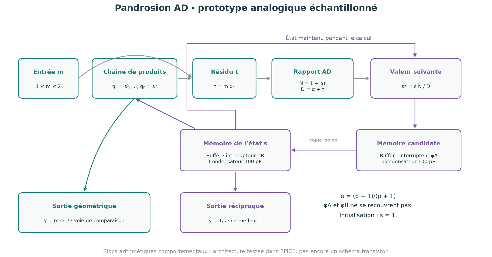
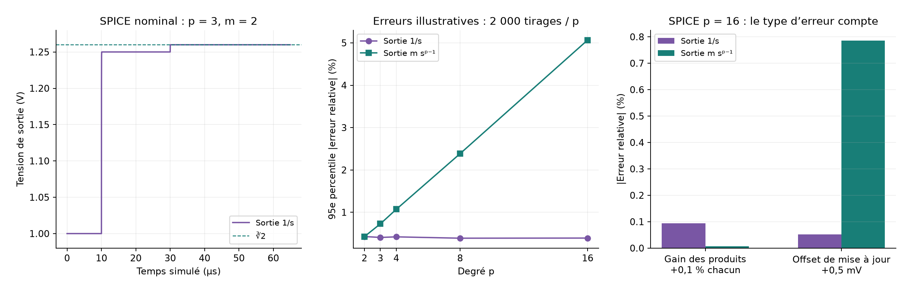

# Pandrosion AD — prototype analogique P0

17 septembre 2026. Premier dossier d'architecture et de simulations exécutées.

**Livrable actuel : un modèle comportemental SPICE échantillonné et une étude d'erreurs. Ce n'est pas encore une puce fabriquable, un schéma transistor ou une preuve de ses performances en silicium.**

Le noyau garde la mise à jour AD persistante. Les rectangles deviennent des relations entre tensions : aucune intersection de droites n'est supposée être une opération électronique gratuite.

## 1. Spécification de travail

| Élément | Choix pour P0 |
|---|---|
| Données | Grandeurs positives, stables pendant un calcul |
| Entrée du noyau | Mantisse m entre 1 et 2 ; 1 V représente une unité |
| Degré | Entier p≥2 dans les équations ; simulations SPICE p=2,3,4,8,16 |
| Configuration | p fixé à la génération de chaque netlist ; programmabilité physique non réalisée |
| État | s₀=1 ; limite s*=m^(−1/p) |
| Sorties étudiées | y_inv=1/s et y_geo=m s^(p−1) |
| Mise à jour | Deux phases de mémorisation non superposées |
| Cadence nominale simulée | 20 µs par mise à jour, choisie pour le modèle, pas mesurée sur du matériel |
| Statut précision | Aucune résolution effective, garantie universelle ni objectif de rendement fabrication revendiqué |

Le premier circuit concret à viser est p=3. Un noyau configurable p=2…16 est une extension d'architecture, avec sélection des produits et des gains. « Toutes les racines » signifie ici une famille paramétrée mathématiquement : une puce finie a nécessairement une plage de degrés, de signaux et de précision spécifiée.

## 2. Équation à implémenter et invariants

Avec α=(p−1)/(p+1), calculer

    q_j = s q_(j−1),  q_1=s,  j=2,…,p,
    t = m q_p,
    N = 1+αt,   D = α+t,
    s⁺ = s N/D.

C'est exactement la droite mobile AD du papier, puisque

    s⁺ = s [p+1+(p−1)m s^p]/[p−1+(p+1)m s^p].

Le théorème mathématique existant donne la convergence globale pour tout m>0 et s₀>0, en arithmétique exacte. Dans le prototype normalisé et initialisé à 1, l'absence de franchissement fournit des bornes bien plus utiles au circuit :

    m^(−1/p) ≤ s_n ≤ 1,
    1/2 ≤ q_j ≤ 1       (1≤j≤p),
    1 ≤ t ≤ m ≤ 2,
    4/3 ≤ N,D < 3.

Ainsi le diviseur reste loin de zéro dans le domaine nominal. Cela explique le choix m∈[1,2] : pas de puissance interne gigantesque à calculer. Les garde-fous de simulation limitent certains nœuds en dehors de ce domaine ; ces saturations modifient l'itération hors domaine et n'héritent pas du théorème global.

Le développement Lean antérieur couvre la carte mathématique et sa dynamique. Il ne couvre pas les RC, interrupteurs, bruits ni modèles exécutables fournis ici.

## 3. Deux mémoires pour conserver l'itération discrète

La séquence simulée est :

1. Maintenir s sur le condensateur d'état pendant que le réseau arithmétique calcule s⁺.
2. À 8 µs, ouvrir la fenêtre φA pendant 0,8 µs pour acquérir s⁺ sur le condensateur candidat.
3. Fermer φA ; à 10 µs, ouvrir φB pendant 0,8 µs pour copier le candidat vers l'état.
4. Répéter avec une période de 20 µs. L'entrée m reste constante pendant les huit mises à jour testées.

Deux buffers isolent les capacités : l'un entre le dernier bloc arithmétique et la mémoire candidate, l'autre entre les deux mémoires. Sans cette isolation, le partage de charge et la charge du filtre de sortie perturbent l'acquisition. Les buffers sont idéaux dans P0 et devront être remplacés par des modèles réalistes.

Les paramètres de simulation sont : mémoires 100 pF, interrupteurs Ron=100 Ω et Roff=10¹² Ω, fuite vers la masse 10¹² Ω, fronts de commande 5 ns. Chaque bloc arithmétique filtré a une réponse du premier ordre R=1 kΩ, C=100 pF, soit τ=100 ns. Ce sont des paramètres d'étude, pas ceux d'un processus CMOS ni d'un composant sélectionné.

Les sources B réalisent les multiplications et divisions abstraites. Le fichier SPICE contient des interrupteurs, capacités et résistances ; **il ne contient pas les transistors des cellules multiplicatrices, diviseuses, buffers ou horloges**. Il ne permet pas d'estimer une consommation ou une surface réaliste. La commande 0/3 V n'est pas la spécification d'une alimentation ASIC.

Une boucle continue sans mémoires aurait une autre équation différentielle. On ne lui attribuerait pas automatiquement la convergence cubique de cette récurrence.

## 4. Le choix de la sortie compte

La lecture géométrique y_geo=m s^(p−1) est conservée comme voie de comparaison. Une seconde sortie y_inv=1/s tend vers la même racine. Pour une petite erreur d'état δs autour de s*=a :

    δy_inv/r ≈ −δs/a,
    δy_geo/r ≈ (p−1)δs/a.

La sortie réciproque est donc p−1 fois moins sensible à **une même perturbation d'état isolée**, au premier ordre. Ce n'est pas une supériorité universelle : elle demande un diviseur supplémentaire et les erreurs corrélées de la chaîne peuvent avantager la lecture géométrique.

Exemple SPICE p=16, m=2, huit mises à jour :

| Perturbation isolée | Erreur y_inv | Erreur y_geo |
|---|---:|---:|
| Gain +0,1 % dans chacun des produits de la chaîne | +0,093758 % | −0,006403 % |
| Offset +0,5 mV dans la mise à jour | −0,052176 % | +0,785921 % |

Les sorties d'observation sont idéales dans cette expérience SPICE : une vraie sortie réciproque ajouterait ses propres erreurs. L'étude Monte-Carlo séparée ajoute des erreurs de sortie.

## 5. Témoin essentiel : Halley direct

Poser y=1/s transforme **chaque pas**, et pas seulement la limite, en

    y⁺ = y [(p−1)y^p+(p+1)m] / [(p+1)y^p+(p−1)m]
       = y [α y^p+m] / [y^p+αm].

C'est Halley direct pour y^p=m. Avec y₀=1, ses itérés correspondent exactement aux inverses des états AD depuis s₀=1. 175 contrôles à 100 chiffres vérifient cette identité et les invariants sur sept degrés jusqu'à 64 ; ce sont des contrôles numériques, pas de nouveaux théorèmes Lean.

Il faut comparer cette architecture à AD avant de chercher un avantage physique :

| Blocs algébriques idéalisés, chaîne déroulée | AD avec sortie 1/s | Halley direct |
|---|---:|---:|
| Produits pour la puissance | p−1 | p−1 |
| Produit supplémentaire m×s^p | 1 | 0 |
| Mise à jour produit/quotient | 1 bloc composé | 1 bloc composé |
| Division de sortie | 1 | 0 |
| Mémoires + buffers | 2 + 2 | 2 + 2 |

Les gains constants et sommes sont à réaliser dans les deux cas. Un bloc composé n'est pas un coût transistor connu. AD évite les valeurs de puissance supérieures à 1, mais Halley direct reste également borné : 1≤y^p≤m≤2. Aucun gain de puissance ou de surface ne découle de cette seule différence.

Le témoin direct a été simulé pour p=3 et p=16, m=2, avec les mêmes mémoires et filtres. Il converge aussi. **AD est une architecture candidate inspirée de la géométrie ; sa supériorité matérielle sur Halley direct n'est pas démontrée.**

## 6. Simulations exécutées

Version locale : ngspice 46. Les journaux, netlists et résultats JSON sont fournis.

### Fonctionnement nominal

20 combinaisons : p∈{2,3,4,8,16}, m∈{1,1.25,1.5,2}, huit mises à jour chacune. Les états SPICE suivent les états exacts de référence, avec un écart absolu maximal de 1,165×10⁻⁷ V sur ces échantillons. L'erreur relative finale maximale de la sortie réciproque vaut environ 1,125×10⁻⁷.

Cette petite erreur reflète un modèle à cellules idéales, fuite fixée et tolérances numériques serrées. **Elle ne signifie pas que le futur circuit aura sept chiffres de précision.** Les ports de lecture sont idéaux et le modèle nominal n'inclut ni mismatch, ni charge injectée, ni bruit de transistor.

Quatre configurations d'erreurs systématiques et quatre durées de calcul ont aussi été simulées, ainsi que les deux témoins Halley : total **30 simulations transitoires SPICE**. Les durées de calcul explorées sont 0,25, 1, 2 et 8 µs pour p=16 ; ce ne sont pas des fréquences maximales mesurées ni un test exhaustif de stabilité.

### Étude illustrant le plancher d'erreur

Dans un modèle Python distinct, 2 000 circuits virtuels par degré, soit 10 000 tirages, sont simulés avec :

- erreur de gain gaussienne indépendante d'écart type 0,1 % par bloc ;
- offset fixe d'écart type 0,1 mV par bloc ;
- bruit additif indépendant de 50 µV par mise à jour et à la sortie ;
- douze mises à jour, m uniforme sur [1,2], graine 1729 ;
- mêmes erreurs fixes d'un pas au suivant dans un circuit virtuel.

Ces distributions sont **choisies pour l'étude**, non extraites d'une fonderie ou de l'AD734. Les tirages ne prédisent donc pas un rendement de fabrication. Le modèle Python ne simule pas la bande passante analogique ni la charge injectée : les études bruit/mismatch et transitoires SPICE sont complémentaires, pas une validation unifiée.

| p | 95e percentile de l'erreur absolue relative, sortie 1/s | Sortie géométrique |
|---:|---:|---:|
| 2 | 0,429 % | 0,426 % |
| 3 | 0,407 % | 0,728 % |
| 4 | 0,421 % | 1,071 % |
| 8 | 0,389 % | 2,384 % |
| 16 | 0,392 % | 5,066 % |

Sous ces hypothèses, itérer davantage ne restaure pas la précision perdue aux erreurs fixes. Le résultat utile est de cibler les erreurs et l'étalonnage, plutôt que d'annoncer une précision matérielle à partir de l'ordre cubique.

## 7. Extension à une grande plage de X

Un noyau analogique borné ne représente pas tous les réels positifs avec une tension finie. Pour une entrée X=m·2^k avec 1≤m<2, écrire k=pq+j, 0≤j<p. Alors

    X^(1/p) = 2^q · 2^(j/p) · m^(1/p).

Le cœur calcule m^(1/p). Le gain 2^(j/p) peut être tabulé pour les degrés pris en charge, puis réalisé/calibré ; 2^q est un changement d'échelle. Cette proposition nécessite un frontal de normalisation et une commande, éventuellement numériques. Elle n'est pas implémentée dans P0 et le gain tabulé ajoute des erreurs. Des données négatives pour les degrés impairs demanderaient une gestion de signe supplémentaire, hors du périmètre positif présent.

Une future puce programmable devrait donc annoncer des bornes explicites sur p et k, une précision cible, son format d'entrée/sortie et sa plage d'alimentation. Le générateur actuel change p hors ligne ; il ne démontre pas une puce reconfigurable pendant l'exécution.

## 8. Passage au schéma électronique concret

La suite de conception est définie, sans fabrication prématurée :

1. **Prototype p=3 à cellules réalistes.** Remplacer les sources comportementales par des modèles vérifiés de multiplicateurs/diviseurs, buffers et interrupteurs. Comparer AD et Halley direct, à entrée, charge et précision communes.
2. **Budget d'erreur.** Mesurer l'offset, le gain, la dérive, l'acquisition, le maintien et la charge injectée. Séparer l'étalonnage de la validation sur d'autres entrées.
3. **Objectif mesurable.** Fixer une plage d'entrée et une erreur relative cible avant de choisir la cadence. Mesurer énergie par conversion, latence, surface estimée et précision ; aucun chiffre de silicium n'est encore disponible.
4. **Circuit intégré.** Choisir une technologie et un PDK, dessiner les cellules et horloges, puis réaliser les simulations de variations processus/tension/température et le layout. Un netlist comportemental ne remplace pas cette étape.
5. **Programmabilité.** Comparer une chaîne de 15 produits avec sélection à un multiplicateur réutilisé séquentiellement ; inclure les mémoires et commandes dans la comparaison.

Le choix initial recommandé reste un démonstrateur de racine cubique, tout en conservant le générateur général. L'intérêt commercial ou une nouveauté brevetable ne sont pas établis par ces simulations.

## 9. Sources techniques consultées

- [Analog Devices, AD734 et fiche technique](https://www.analog.com/en/products/ad734.html) : exemple commercial d'opération W=XY/U. Référence de faisabilité des opérations, **pas le modèle utilisé** dans les simulations et pas un choix définitif de composant.
- [Analog Devices, AN-1515, sample-and-hold avec ADG1211](https://www.analog.com/en/resources/app-notes/an-1515.html) : mécanisme de maintien et charge injectée par l'interrupteur.
- [Texas Instruments, TIDA-00003](https://www.ti.com/tool/TIDA-00003) : exemple de conception sample-and-hold, avec des paramètres dépendant du condensateur et du circuit.
- [Manuel ngspice](https://ngspice.sourceforge.io/docs/ngspice-manual.pdf) : sources comportementales, interrupteurs et simulation transitoire. Le manuel en ligne consulté annonce la version 47 ; les simulations jointes ont été exécutées avec la version locale 46.
- [Construction AD et preuve mathématique antérieure](../pandrosion_geometry/MOVING_REPORT.md), [périmètre Lean](../pandrosion_geometry/LEAN_GEOMETRY.md).

## 10. Reproduction

Installer ngspice, Python, numpy, mpmath et matplotlib. Depuis ce dossier :

    python3 simulate_spice.py
    python3 simulate_errors.py
    python3 make_figures.py

Ou utiliser `run_all.sh`. `PANDROSION_PYTHON` permet de sélectionner l'interpréteur. Aucun accès réseau ni fabrication n'est déclenché par ces scripts.

- `ad_core_p3.cir` : netlist autonome du noyau AD nominal ; lancer `ngspice -b ad_core_p3.cir` dans un dossier de travail. Il produit `waveform.txt`.
- `halley_control_p3.cir` : témoin direct.
- `spice_results.json` : 30 cas et échantillons après chaque mise à jour.
- `spice_waveform.csv` et `spice_nominal.log` : trace décimée et journal de p=3,m=2.
- `error_results.json` : hypothèses, tirages, contrôles et sensibilités.
- `architecture.svg`, `prototype_results.svg` : figures vectorielles éditables.

Les scripts conservent leurs critères de vérification nominaux. Aucun résultat n'est présenté comme une mesure de matériel, une simulation post-layout ou une preuve Lean du circuit.
