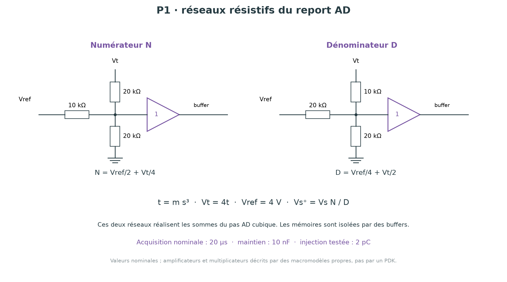
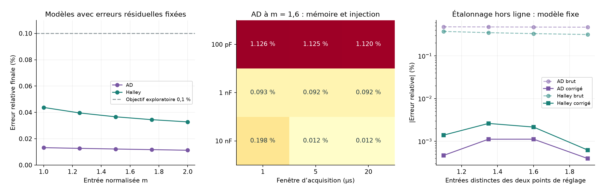

# Pandrosion analogique — P1 : démonstrateur cubique non idéal

17 septembre 2026. Suite du prototype P0. Les fichiers P0, la V16 et les preuves Lean antérieures sont conservés.

**P1 est un prototype simulé à macromodèles propres. Il ajoute des réseaux de résistances réels dans SPICE, des limites électriques et une étude d'étalonnage. Il n'est pas encore un schéma transistor, un modèle constructeur validé ou une puce fabricable.**

## Résultat de cette étape

La configuration cubique retenue atteint une erreur relative inférieure à 0,1 % sur les cinq entrées testées, avec les hypothèses d'erreurs résiduelles fixées ci-dessous. Le témoin Halley direct atteint également cette cible. La conception met en évidence trois contraintes concrètes : respecter les plages des ports des multiplicateurs, isoler les condensateurs de mémoire, et équilibrer leur capacité avec le temps d'acquisition.

66 simulations SPICE sont fournies pour la configuration retenue : 30 cas entrée/profil, 20 variantes de mémoire/signe, 16 entrées supplémentaires pour l'étalonnage. Deux configurations rejetées sont conservées séparément dans `diagnostics/` pour expliquer les échecs de traduction électrique ; elles ne sont pas les résultats du montage retenu.

## 1. Échelle et cœur AD

Le noyau reçoit m∈[1,2]. Une unité vaut 4 V : Vm=4m est compris entre 4 et 8 V. L'état est Vs=4s, initialisé à 4 V. Pour p=3 :

    t = m s³,
    s⁺ = s (1+t/2)/(1/2+t),
    y = 1/s → ∛m.

Les produits sont réalisés par des cellules abstraites W=XY/U. Avec Vref=4 V :

    Vq2 = Vs²/Vref,
    Vq3 = Vq2·Vs/Vref,
    Vt  = Vq3·Vm/Vref.

On divise ensemble numérateur et dénominateur par 2 pour réduire les tensions internes :

    N = Vref/2 + Vt/4,
    D = Vref/4 + Vt/2,
    Vs⁺ = Vs·N/D.

Ces deux sommes utilisent chacune un réseau passif de trois résistances suivi d'un buffer.

| Nœud | Résistance vers Vref | Résistance vers Vt | Résistance vers masse |
|---|---:|---:|---:|
| N, avant buffer | 10 kΩ | 20 kΩ | 20 kΩ |
| D, avant buffer | 20 kΩ | 10 kΩ | 20 kΩ |

Les valeurs découlent directement de la moyenne pondérée par les conductances, et sont présentes dans la netlist. Les tensions N,D sont au moins 3 V dans le domaine idéal normalisé. Le rapport ne divise donc pas par une quantité proche de zéro pendant le fonctionnement nominal.

## 2. Contraintes des ports : correction de la traduction naïve

La fiche technique AD734 décrit une fonction XY/U, mais ses ports ne sont pas interchangeables du point de vue des limites électriques. Pour la condition de division indiquée, le seuil d'écrêtage de X vaut environ 1,25U lorsque Y≤10 V. Nous avons ajouté ce seuil et une limite de Y à ±10 V à nos **propres** macromodèles. Cette approximation à écrêtage abrupt n'est pas le modèle AD734 du constructeur.

Ainsi, le calcul naïf de la sortie 1/s par X=Y=4 V, U=Vs serait à la limite : pour ∛2, Vs≈3,1748 V et 4/Vs≈1,2599>1,25. La solution retenue est X=2 V, Y=8 V, U=Vs. Le produit XY reste 16 V², mais X/U reste loin du seuil. La génération physique de ces références 2 V et 8 V à partir de 4 V devra être modélisée ; elle utilise encore des sources contrôlées idéales dans P1.

| Cellule AD | Port X | Port Y | Port U |
|---|---|---|---|
| q₂ | Vs | Vs | 4 V |
| q₃ | Vq₂ | Vs | 4 V |
| t | Vq₃ | Vm | 4 V |
| Mise à jour | N | Vs | D |
| Lecture 1/s | 2 V | 8 V | Vs |
| Lecture géométrique de comparaison | Vq₂ | Vm | 4 V |

Le témoin Halley a aussi été adapté : les puissances de sa variable y sont plus grandes. Un gain 5/3 sur l'état, des atténuateurs résistifs et une permutation des ports préservent les produits tout en respectant leurs plages. Par exemple q₂ utilise X=0,6Vy et Y=(5/3)Vy. L'atténuation 0,6Vy est dérivée de la sortie amplifiée, pas directement du condensateur de mémoire.

Le maximum surveillé est max(|X|/(1,25U), |Y|/10 V), sur toutes les cellules après la remise à zéro et la stabilisation initiale. Il reste inférieur à 0,843 sur la grille de 30 cas retenus. L'écrêtage n'explique donc pas les erreurs finales de cette grille.

Le modèle protège numériquement le dénominateur sous 0,4 V pendant le démarrage. Cette protection n'est pas un circuit électrique réalisé. Les sorties pendant la remise à zéro ne sont pas déclarées valides.

## 3. Mémoire, reset et horloge

Deux condensateurs, candidat et état, remplacent le stockage abstrait de P0. La configuration nominale de P1 utilise 10 nF par mémoire. Les interrupteurs sont des modèles SW : Ron=100 Ω, Roff=10¹² Ω. Une résistance de fuite de 10¹² Ω, un courant de fuite explicite et des impulsions de charge à l'ouverture complètent le modèle.

La remise à zéro connecte les deux mémoires à une référence 4 V bufferisée pendant 50 µs. Les capacités démarrent à zéro : P1 ne suppose plus une charge initiale idéale préétablie.

Après le reset : calcul 30 µs, acquisition du candidat 20 µs, temps mort 5 µs, copie vers l'état 20 µs, puis 25 µs de maintien. La période est de 100 µs. Les résultats sont lus 5 µs avant la fin de chaque période. Le contrôle temporel reste constitué de sources d'horloge idéales : leur génération physique n'est pas encore conçue.

**Les résistances ne doivent pas charger directement l'état mémorisé.** Un premier atténuateur du témoin Halley présentait environ 50 kΩ au condensateur de 10 nF, soit un temps de décharge de 0,5 ms ; le calcul était gravement biaisé. La correction consiste à alimenter ce réseau depuis un buffer. Le diagnostic est conservé dans `diagnostics/loaded_hold_capacitor.json`.

## 4. Modèles et hypothèses

Les cellules arithmétiques utilisent une réponse du premier ordre de 100 ns, une vitesse de variation limitée à 10 V/µs, une résistance de sortie de 5 Ω et une limite de courant de 5 mA. Les buffers utilisent 80 ns, 5 V/µs, 0,5 Ω, 5 mA et un gain statique de 0,99999. Les cibles internes sont limitées à ±10,5 V. Les charges de sortie sont 5 kΩ en parallèle avec 20 pF.

Ces paramètres sont des choix d'étude transparents. Ils ne reproduisent pas toutes les caractéristiques de l'AD734 ou d'un amplificateur nommé. Les charges et les résistances de sortie créent des erreurs même dans le profil nommé `ideal_dynamic` : ce profil signifie seulement absence des erreurs supplémentaires de la table suivante.

| Paramètre | `ideal_dynamic` | `trimmed_stress` | `untrimmed_stress` |
|---|---:|---:|---:|
| Erreur de gain des cellules arithmétiques | 0 | ±0,01 % | ±0,1 % |
| Offset de ces cellules | 0 | ±0,2 mV | ±5 mV |
| Offset des buffers | 0 | ±0,2 mV | ±1 mV |
| Courant de fuite par mémoire | 0 | 1 nA | 5 nA |
| Charge injectée par ouverture | 0 | 2 pC | 5 pC |
| Erreur des six résistances de sommation | 0 | ±0,01 % | ±0,1 % |

Les signes sont fixes et alternés dans l'ordre des blocs, identiques d'un pas au suivant ; le script les expose. Un essai supplémentaire inverse le signe à m=1,6. Ce ne sont ni des coins de fabrication ni un échantillon statistique de rendements. Le nom `trimmed_stress` exprime une hypothèse de petites erreurs résiduelles ; aucun étalonnage interne des cellules n'a été exécuté.

Le gain 5/3 et les atténuateurs supplémentaires du témoin sont nominaux, avec un buffer non idéal. Les références 2/4/8 V ne présentent pas de dérive dans ce modèle. P1 n'inclut ni bruit stochastique temporel, ni température, ni parasites de layout, ni découplage des alimentations, ni couplage d'horloge complet. Le modèle de charge injectée est une impulsion calibrée en aire, pas un transistor de commutation.

## 5. Comparaison à objectif égal

Pour chaque méthode et chaque profil, les entrées m=1 ; 1,25 ; 1,5 ; 1,75 ; 2 sont testées sur six mises à jour. Le tableau donne le maximum de l'erreur relative absolue finale sur ces cinq points.

| Profil | AD, sortie 1/s | Halley direct |
|---|---:|---:|
| Dynamique, sans mismatch supplémentaire | 0,01524 % | 0,00444 % |
| Petites erreurs résiduelles fixées | 0,01322 % | 0,04377 % |
| Erreurs plus grandes fixées | 0,47890 % | 0,38554 % |

Les deux méthodes atteignent 0,1 % sur les cinq points du profil à petites erreurs, au plus tard à l'échantillon 245 µs après le début du reset. La première mise à jour suffit pour certains points proches de 1. Le critère « atteint » exige que les échantillons suivants restent aussi dans la tolérance, jusqu'à la fin des six mises à jour. Ce n'est ni une borne continue en temps, ni une preuve pour toutes les entrées.

Aucune des deux ne satisfait ce même seuil sur la grille du profil à grandes erreurs sans correction de lecture. Le classement change selon le profil : cette étude ne démontre pas une supériorité universelle de AD.

Dans la réalisation fonctionnelle, AD avec la seule sortie réciproque demande cinq cellules produit/quotient, contre trois pour Halley direct. La netlist AD de diagnostic en comporte six car elle construit aussi la lecture géométrique. Les buffers, atténuateurs, références et commandes s'ajoutent. Aucun coût de silicium ne peut être déduit de ces seuls nombres.

## 6. Capacité et acquisition : un vrai compromis

À m=1,6, avec le profil de petites erreurs, le balayage croise C=100 pF, 1 nF, 10 nF et des acquisitions de 1, 5 et 20 µs pour les deux méthodes.

Pour AD :

- 100 pF : erreur finale d'environ 1,12 %, dominée ici par la charge injectée et le maintien ; allonger l'acquisition ne suffit pas.
- 1 nF : environ 0,092 % sur les trois acquisitions testées, proche de l'objectif 0,1 %.
- 10 nF et acquisition 1 µs : environ 0,198 %, acquisition trop courte pour les six mises à jour choisies.
- 10 nF et acquisition 5 ou 20 µs : environ 0,012 %.

L'ordre de grandeur ΔV=Q/C explique pourquoi 2 pC produisent 20 mV sur 100 pF, mais seulement 0,2 mV sur 10 nF. Augmenter C augmente aussi la charge à déplacer et le temps d'acquisition avec un courant limité. La configuration nominale retenue conserve 20 µs : le cas plus rapide à 5 µs n'a pas été validé sur toute la grille d'entrée.

## 7. Étalonnage de lecture, sur des entrées distinctes

On ajuste **hors ligne** une correction affine y_corr=a·y_brut+b aux deux points m=1 et m=2, puis on fige a,b. Les quatre points de validation sont m=1,1 ; 1,35 ; 1,6 ; 1,9. Ils font l'objet de 16 simulations SPICE supplémentaires, pour deux méthodes et deux profils.

| Profil | Maximum AD après correction | Maximum Halley après correction |
|---|---:|---:|
| Petites erreurs résiduelles | 0,000175 % | 0,000410 % |
| Erreurs plus grandes | 0,001123 % | 0,002622 % |

Ces résultats montrent qu'une partie importante de l'erreur du modèle fixe est corrigeable par gain et offset. Ils ne constituent pas une précision garantie : quatre points, paramètres constants, aucun bruit ni température. La correction est appliquée en Python à la lecture SPICE ; **l'amplificateur de correction et son étalonnage matériel ne figurent pas dans le circuit**. Il faut compter leurs propres erreurs et leur coût avant de retenir ces chiffres comme objectif de réalisation.

## 8. Ce qui est réellement prêt, et prochaine étape

Prêts : équations de blocs, réseaux résistifs, netlists reproductibles, modèle des mémoires, démarrage, contraintes de ports, critère d'acceptation échantillonné et protocole de calibration distinct de sa validation.

Restent à concevoir : cellules électroniques sélectionnées, modèle fournisseur autorisé/validé, alimentations et références, bruit et température, horloges et reset physiques, étalonnage matériel, schéma transistor/PCB et mesures. Aucune consommation réaliste, aire ASIC, fréquence maximale ou nouveauté brevetable n'est annoncée.

La piste AD reste viable dans ce modèle. Halley direct reste le témoin obligatoire. La prochaine comparaison utile porte sur des cellules électroniques réellement choisies et sur la précision après variation des conditions, plutôt que sur le seul nombre d'itérations mathématiques.

## 9. Sources

- [AD734, fiche technique Rev. E](https://www.analog.com/media/en/technical-documentation/data-sheets/ad734.pdf), pages 3 et 11–14 : fonction produit/quotient, contraintes et modes de division. Les valeurs de P1 ne sont pas un modèle ajusté à cette fiche.
- [AD734, page constructeur](https://www.analog.com/en/products/ad734.html) : le modèle SPICE officiel a été identifié. Son téléchargement conduit à une licence ; ce modèle n'a pas été téléchargé ni utilisé dans P1. La licence n'a pas été acceptée en votre nom.
- [Analog Devices AN-1515](https://www.analog.com/en/resources/app-notes/an-1515.html) : échantillonnage-maintien et injection de charge.
- [Manuel ngspice](https://ngspice.sourceforge.io/docs/ngspice-manual.pdf) : sources comportementales et analyses transitoires. Exécution avec ngspice 46.

## 10. Reproduction

Python avec numpy et matplotlib ; ngspice installé. Depuis ce répertoire :

    python3 simulate_p1.py
    python3 calibrate.py
    python3 make_report.py

Ou `bash run_all.sh`, avec la variable facultative `PANDROSION_PYTHON`.

`ad_p1.cir` et `halley_p1.cir` sont autonomes : lancer `ngspice -b ad_p1.cir` dans un dossier de travail produit `waveform.txt`. Les sources et paramètres sont lisibles ; aucun modèle constructeur externe n'est requis.

`results.json` conserve les 50 cas principaux ; `calibration.json`, les 16 validations supplémentaires et les coefficients ; `comparison.csv`, la grille principale ; les CSV de formes d'onde sont décimés pour l'affichage. Les tests automatiques contrôlent le domaine des ports et l'objectif 0,1 % sur la grille des deux profils les plus faibles. Les cas de stress plus grands sont conservés même lorsqu'ils échouent à cet objectif.

Aucune preuve Lean de ces circuits n'est revendiquée. Le théorème global de l'itération idéale ne s'étend pas automatiquement aux rails, au bruit, à la charge injectée ou aux transitoires matériels.
